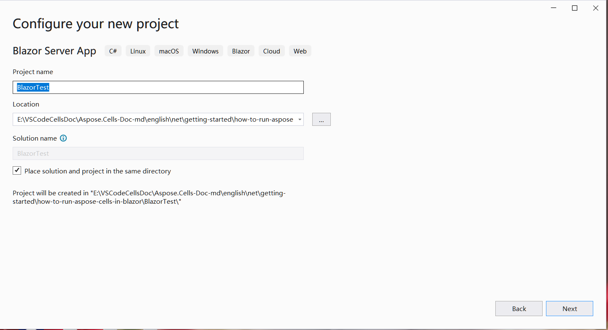

##  ملخص

 لتشغيل Aspose.Cells في Blazor، تحتاج إلى منصات .NET6 (أو الأحدث)، مقارنة بالمنصات السابقة (.netcore31 أو قبلها)، هناك اختلاف مهم يتعلق بمكتبة الرسومات. في هذا الرسمي[Microsoft وثيقة](https://learn.microsoft.com/en-gb/dotnet/core/compatibility/core-libraries/6.0/system-drawing-common-windows-only)، فهو يوضح أنه بالنسبة لـ .NET6 أو الإصدارات الأحدث، سيتم دعم مكتبة الرسومات "System.Drawing.Common" فقط على Windows، ويقدم توصيات لاستبدال مكتبة الرسومات.

بالنسبة لمنتج Apose.Cells، أجرينا التقييم وأكملنا ترحيل مكتبة الرسومات. نحن نستخدم SkiaSharp بدلاً من System.Drawing.Common في الأنظمة غير Windows، كما هو مقترح في الوثائق الرسمية لـ Microsoft. يرجى ملاحظة أن هذا التغيير الحاسم سيدخل حيز التنفيذ في Aspose.Cells 22.10.1 أو إصدار أحدث لـ .Net6.

##  تطبيق Blazor الأول مع Aspose.Cells

في هذا المثال، يمكنك إنشاء تطبيق خادم blazor بسيط يضيف بعض البيانات والرسومات، ويحولها إلى صور لعرضها على صفحة الويب. أثناء عملية إنشاء المشروع، يمكنك تكوين الخيارات وفقًا لاحتياجاتك الخاصة. على سبيل المثال، عند تحديد خيار "تمكين Docker"، يمكن بعد ذلك إنشاء تطبيق blazor وتشغيله في Docker..

###  قم بإنشاء تطبيق Blazor الأول

لنستخدم أداة VS2022 كمثال لإنشاء تطبيق blazor الأول برقم Aspose.Cells، اتبع الخطوات التالية:
1. حدد ملف ->جديد ->مشروع وقم بالتصفية باستخدام الكلمة الأساسية blazer لتحديد قالب المشروع المقابل.
<br>

1. اضبط اسم المشروع على "BlazorTest" وحدد المسار.
<br>

1. تكوين المكتبات والخيارات الأخرى المستخدمة في المشروع. وأخيرًا، انقر فوق الزر "إنشاء" لإنشاء أول مشروع بليزر خاص بك.
<br>

1. بعد الدخول إلى المشروع، انقر فوق "التبعيات" ضمن المشروع وحدد "إدارة حزم NuGet..." لإضافة مكتبة Aspose.Cells.
<br>

1. أدخل الكلمات الأساسية لتصفية وتثبيت أحدث مكتبة Aspose.Cells. سيتم أيضًا تثبيت المكتبات المعتمدة بشكل متزامن مثل SkiaSharp معًا.
<br>

1. انقر نقرًا مزدوجًا على ملف "Index.razor" لتحرير واستيراد المكتبة المطلوبة. أضف بعض البيانات والرسومات، وقم بتحويلها إلى رسومات للعرض.
<br>

1. قم بتجميع المشروع وتشغيله، وستحصل على النتائج التالية.
<br>


###  نموذج التعليمات البرمجية في تطبيق Blazor الأول

تم تضمين نموذج التعليمات البرمجية التالي في ملف Index.razor:
```
@page "/"
@using SkiaSharp;
@using Aspose.Cells;
@using Aspose.Cells.Drawing;
@using Aspose.Cells.Rendering;


<PageTitle>Index</PageTitle>

<h1>Hello, world!</h1>

Welcome to your new app.

<SurveyPrompt Title="How is Blazor working for you?" />


@code
{
    private string imageSrc;

    public Index()
    {
        imageSrc = "data:image/png;base64, " + Convert.ToBase64String(CreateFile());
    }

    private byte[] CreateFile()
    {
        Workbook workbook = new Workbook();
        Worksheet sheet = workbook.Worksheets[0];
        sheet.Cells["A1"].Value = "test data for blazor";

        sheet.PageSetup.PrintGridlines = true;
        sheet.PageSetup.PrintArea = "A1:F20";

        ShapeCollection shapes = sheet.Shapes;

        //Add rectangle shape
        shapes.AddRectangle(1, 0, 1, 0, 100, 150);

        //Add line shape
        shapes.AddLine(8, 0, 1, 0, 100, 150);

        //Add oval shape
        shapes.AddOval(13, 0, 1, 0, 100, 150);

        using MemoryStream ms = new();

        SheetRender render = new SheetRender(sheet, new ImageOrPrintOptions());
        render.ToImage(0, ms);

        return ms.ToArray();
    }
}

```