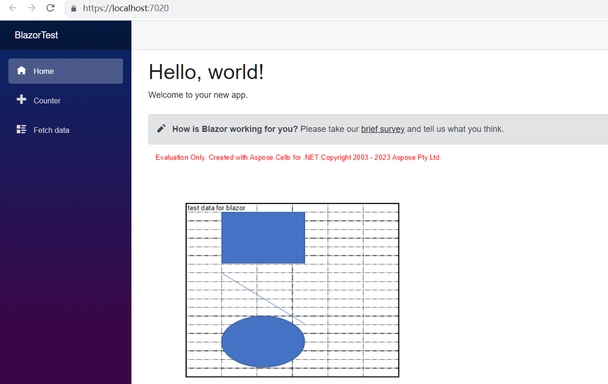

## نظرة عامة

لتشغيل Aspose.Cells في Blazor، تحتاج إلى منصات .NET6 (أو أحدث)، بالمقارنة مع المنصات السابقة (.netcore31 أو قبل ذلك)، الفارق المهم هو حول مكتبة الرسومات. في هذا المستند الرسمي [Microsoft Document](https://learn.microsoft.com/en-gb/dotnet/core/compatibility/core-libraries/6.0/system-drawing-common-windows-only)، يشرح لـ .NET6 أو إصدارات أحدث سيتم دعم مكتبة الرسومات "System.Drawing.Common" فقط على نظام ويندوز، ويقدم توصيات لاستبدال مكتبة الرسومات.

بالنسبة لمنتج Apose.Cells، قمنا بإجراء التقييم وقمنا بإكمال ترحيل مكتبة الرسومات. نحن نستخدم SkiaSharp بدلاً من System.Drawing.Common في أنظمة غير ويندوز، كما اقترح في وثائق مايكروسوفت الرسمية. يرجى ملاحظة أن هذا التغيير الحرج سيكون ساري المفعول في Aspose.Cells 22.10.1 أو أحدث لـ .Net6.

## تطبيق Blazor Server مع Aspose.Cells

في هذا المثال، قم بإنشاء تطبيق بسيط لخادم blazor يضيف بعض البيانات والرسومات، ويقوم بإظهارها في صور لعرضها على صفحة الويب. أثناء عملية إنشاء المشروع، يمكنك تكوين الخيارات وفقًا لاحتياجاتك الخاصة. على سبيل المثال، عندما تحدد خيار "تمكين Docker"، يمكن بناء تطبيق blazor ثم تشغيله في Docker.

### إنشاء تطبيق Blazor Server

دعونا نستخدم أداة VS2022 كمثال لإنشاء أول تطبيق Blazor باستخدام Aspose.Cells، اتبع الخطوات أدناه:
1. حدد ملف -> جديد -> مشروع وقم بتصفية باستخدام كلمة blazer لتحديد قالب المشروع المقابل.
<br>

1. قم بتعيين اسم المشروع إلى "BlazorTest" وحدد المسار.
<br>

1. قم بتكوين المكتبات والخيارات الأخرى المستخدمة في المشروع. في النهاية، انقر على زر "إنشاء" لتوليد مشروع blazer الأول الخاص بك.
<br>

1. بعد دخول المشروع، انقر فوق "التبعيات" تحت المشروع واختر "إدارة حزم NuGet..." لإضافة مكتبة Aspose.Cells.
<br>

1. أدخل الكلمات الرئيسية للتصفية وقم بتثبيت مكتبة Aspose.Cells الأحدث. ستتم أيضًا تثبيت المكتبات التابعة مثل SkiaSharp معًا.
<br>

1. انقر نقرًا مزدوجًا فوق ملف "Index.razor" للتحرير واستيراد المكتبة المطلوبة. أضف بعض البيانات والرسومات، وقم بتقديمها في رسومات للعرض.
<br>

1. قم بتجميع وتشغيل المشروع، وستحصل على النتائج التالية.
<br>


### كود عيني في تطبيق خادم Blazor

تتضمن الكود العيني التالي في ملف Index.razor:
```
@page "/"
@using SkiaSharp;
@using Aspose.Cells;
@using Aspose.Cells.Drawing;
@using Aspose.Cells.Rendering;


<PageTitle>Index</PageTitle>

<h1>Hello, world!</h1>

Welcome to your new app.

<SurveyPrompt Title="How is Blazor working for you?" />


@code
{
    private string imageSrc;

    public Index()
    {
        imageSrc = "data:image/png;base64, " + Convert.ToBase64String(CreateFile());
    }

    private byte[] CreateFile()
    {
        Workbook workbook = new Workbook();
        Worksheet sheet = workbook.Worksheets[0];
        sheet.Cells["A1"].Value = "test data for blazor";

        sheet.PageSetup.PrintGridlines = true;
        sheet.PageSetup.PrintArea = "A1:F20";

        ShapeCollection shapes = sheet.Shapes;

        //Add rectangle shape
        shapes.AddRectangle(1, 0, 1, 0, 100, 150);

        //Add line shape
        shapes.AddLine(8, 0, 1, 0, 100, 150);

        //Add oval shape
        shapes.AddOval(13, 0, 1, 0, 100, 150);

        using MemoryStream ms = new();

        SheetRender render = new SheetRender(sheet, new ImageOrPrintOptions());
        render.ToImage(0, ms);

        return ms.ToArray();
    }
}

```
