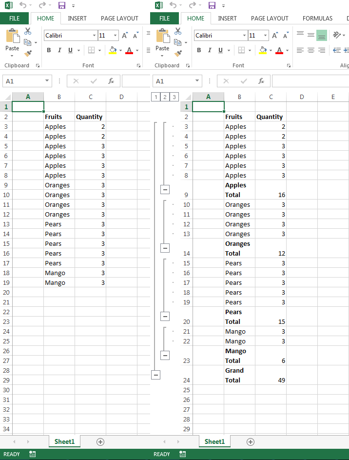

# Aspose.Cells for C++ : Creating Subtotals


*   1 [Creating Subtotals](#creating-subtotals)
*   2 [Sample Code](#sample-code)

 

 

## Creating Subtotals

The following sample code shows how to create subtotals using Aspose.Cells. The code loads the [sample excel file](https://docs2.aspose.com/cells/cpp/attachments/21102597/21266433.xlsx) and creates subtotals on the cell range B13:C19 and saves the [output excel file](https://docs2.aspose.com/cells/cpp/attachments/21102597/21266437.xlsx). The following screenshot shows how the sample and output excel file looks after the execution of the code.

## Sample Code

