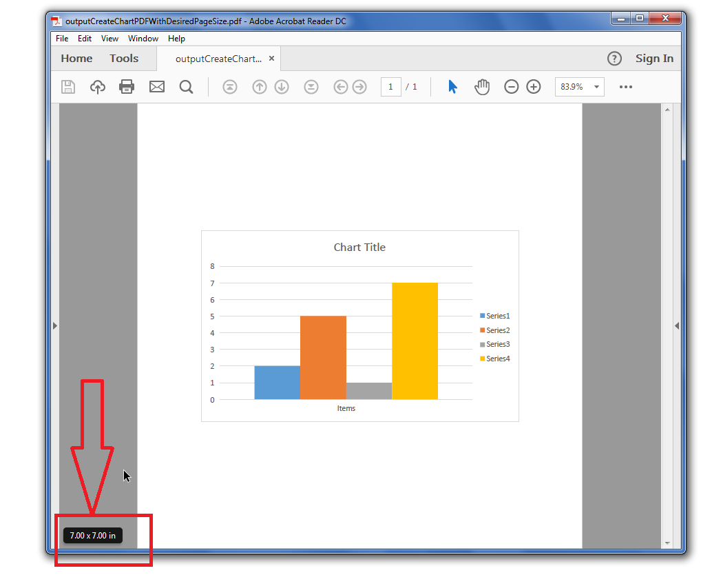

# Aspose.Cells for Java : Create Chart PDF with Desired Page Size


*   1 [Possible Usage Scenarios](#possible-usage-scenarios)
*   2 [Create Chart PDF with Desired Page Size](#create-chart-pdf-with-desired-page-size)
*   3 [Sample Code](#sample-code)

 

## Possible Usage Scenarios

You can create a chart PDF with your desired page size using Aspose.Cells and specify how you want to align the chart inside the page. You may align the chart to the top, bottom, center, left, right, etc. Besides, the output chart can be created in a stream or on disk.

## Create Chart PDF with Desired Page Size

Please see the following sample code that loads the [sample Excel file](https://docs2.aspose.com/cells/java/attachments/64456320/64716912.xlsx), accesses the first chart inside the worksheet and then converts it into [output PDF](https://docs2.aspose.com/cells/java/attachments/64456320/64716911.pdf) with desired page size. The following screenshot shows that the page size in the output PDF is 7x7 as specified inside the code and chart is center aligned both horizontally as well as vertically. 

## Sample Code

