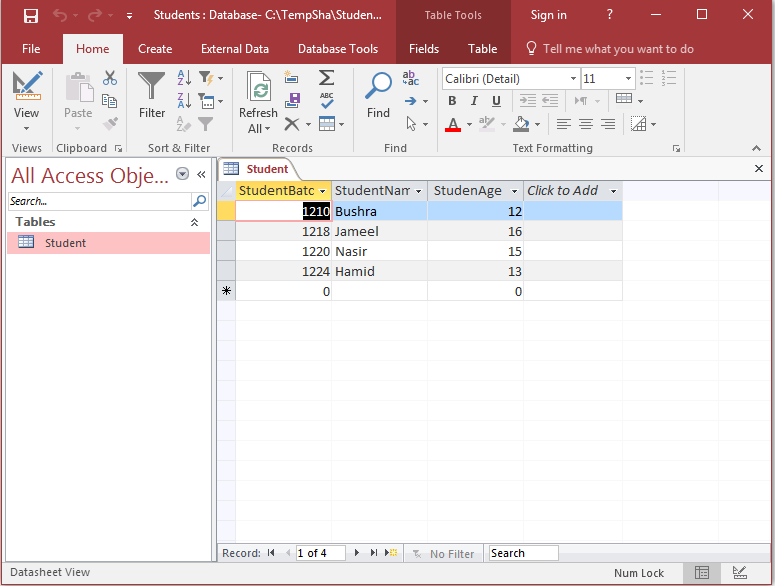
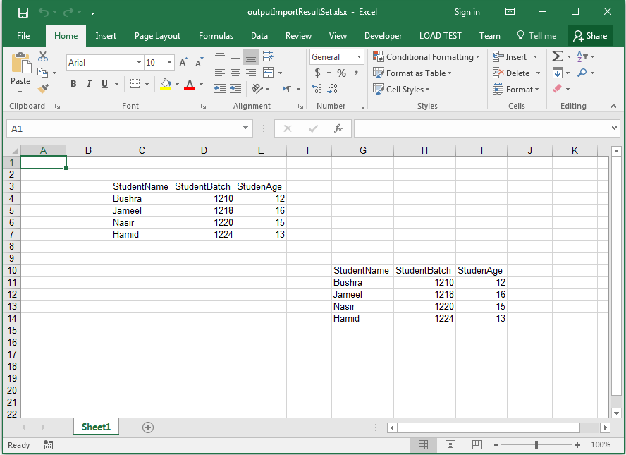

# Aspose.Cells for Java : Import Data from Microsoft Access Database ResultSet Object to the Worksheet


*   1 [Possible Usage Scenarios](#possible-usage-scenarios)
*   2 [UCanAccess - Required to Connect to Microsoft Access Database](#ucanaccess---required-to-connect-to-microsoft-access-database)
*   3 [Sample Microsoft Access 2016 Database File used inside Sample Code](#sample-microsoft-access-2016-database-file-used-inside-sample-code)
*   4 [Import Data from Microsoft Access Database ResultSet Object to the Worksheet.](#import-data-from-microsoft-access-database-resultset-object-to-the-worksheet.)
*   5 [Sample Code](#sample-code)

 

## Possible Usage Scenarios

Aspose.Cells can import data to worksheets from ResultSet object which can be created from any database. However, this article specifically creates a ResultSet object from Microsoft Access Database. Since the code is the same for all types of databases, so you can use it in general.

## UCanAccess - Required to Connect to Microsoft Access Database

Please download [UCanAccess](http://ucanaccess.sourceforge.net/site.html). It includes the following JAR files. Add all of them in the classpath.

*   ucanaccess-4.0.1.jar
*   commons-lang-2.6.jar
*   commons-logging-1.1.1.jar
*   hsqldb.jar
*   jackcess-2.1.6.jar

For more help, please visit this Stack Overflow link.

*   [Manually adding the JARs to your project](https://stackoverflow.com/questions/21955256/manipulating-an-access-database-from-java-without-odbc/21955257#21955257)

## Sample Microsoft Access 2016 Database File used inside Sample Code

The following sample Microsoft Access 2016 Database File was used inside the sample code. You can use any database file or create your own.

*   [Students.accdb](https://docs2.aspose.com/cells/java/attachments/48136926/48496712.accdb)

The following screenshot shows the database file when opened in Microsoft Access 2016.

## Import Data from Microsoft Access Database ResultSet Object to the Worksheet.

The following sample code executes SQL query from Microsoft Access Database and creates a ResultSet object. Then it imports data from ResultSet object into worksheet using [Worksheet.getCells().importResultSet()](https://apireference.aspose.com/java/cells/com.aspose.cells/cells#importResultSet(java.sql.ResultSet,%20int,%20int,%20boolean)) method. The first time, it uses row and column indices and then it uses cell name to import data into the worksheet. Finally, it saves the workbook as an [Output Excel File](https://docs2.aspose.com/cells/java/attachments/48136926/48496713.xlsx). The screenshot shows the effect of the sample code on the output Excel file for a reference.

## Sample Code

