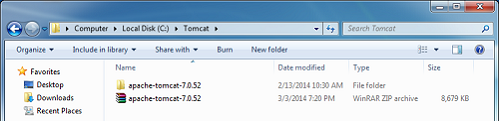
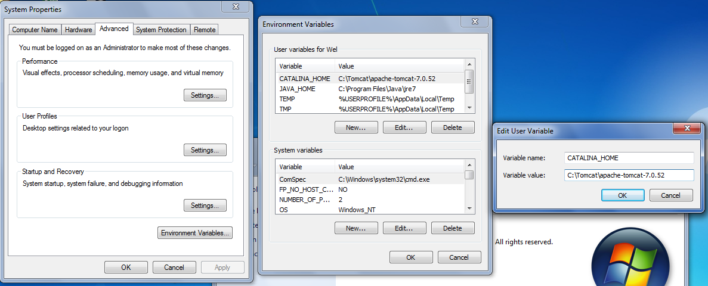
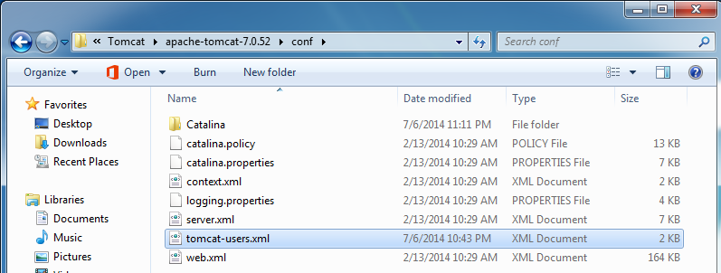
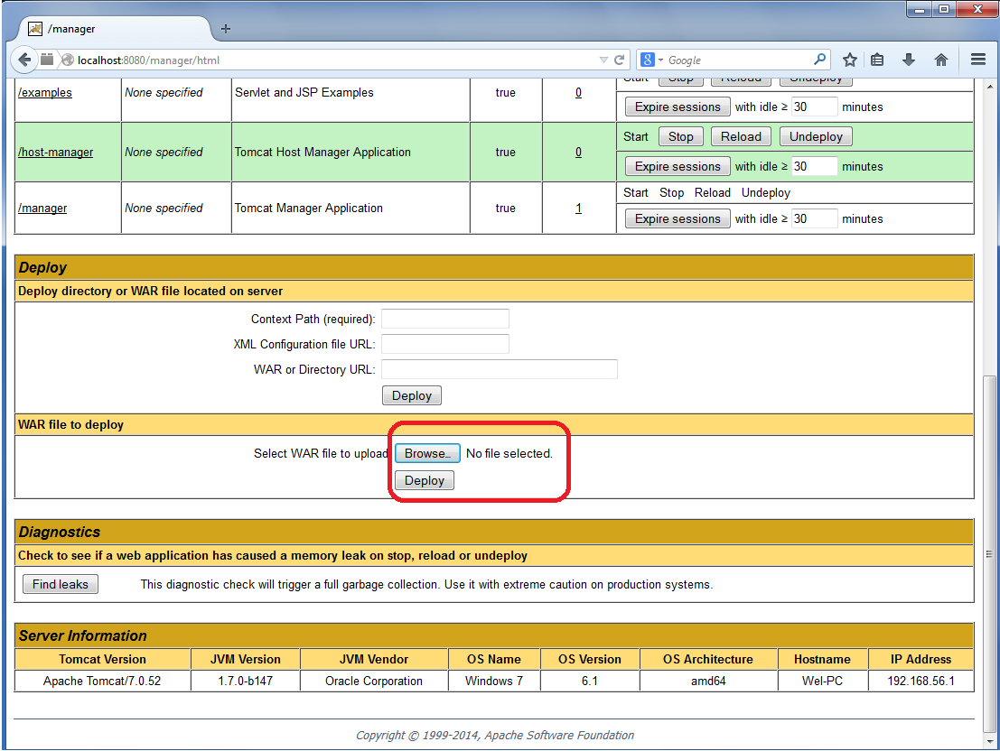
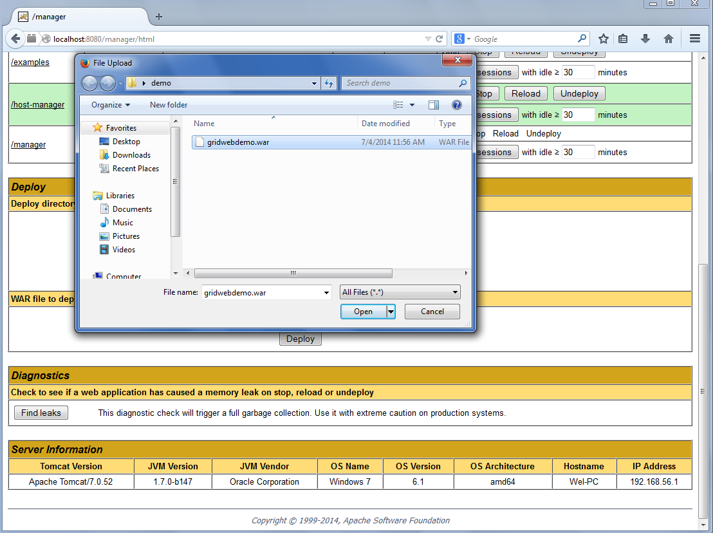
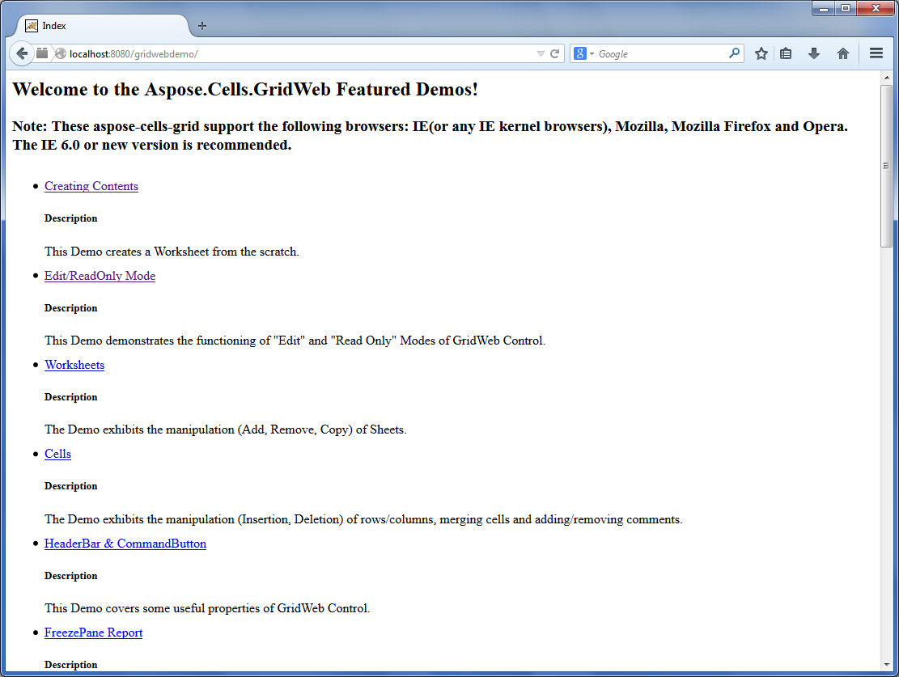
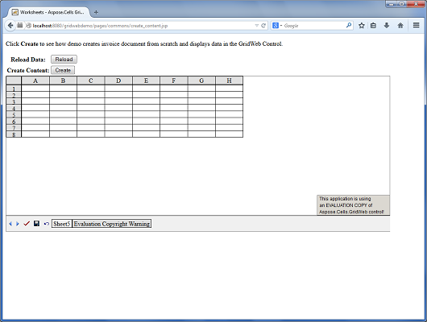

# Aspose.Cells for Java : Introduction of GridWeb


*   1 [How to run Aspose.Cells for GridWeb Java Demos](#how-to-run-aspose.cells-for-gridweb-java-demos)
    *   1.1 [Step by Step Guide to Run GridWeb Java Demos](#step-by-step-guide-to-run-gridweb-java-demos)
*   2 [Aspose.Cells.GridWeb - Demos](#aspose.cells.gridweb---demos)
*   3 [Browsers Capabilities and Aspose.Cells.GridWeb](#browsers-capabilities-and-aspose.cells.gridweb)
    *   3.1 [Comparison](#comparison)

 

 

## How to run Aspose.Cells for GridWeb Java Demos

Aspose.Cells for GridWeb Java demos are easy to run. You just need to deploy **gridwebdemo.war** in your web server. Please download the demos from this [link](https://forum.aspose.com/uploads/discourse_instance3/22292).

This article describes how to run Aspose.Cells for GridWeb Java Demos in Apache Tomcat Server.

### Step by Step Guide to Run GridWeb Java Demos

1.  Extract **apache-tomcat-7.0.52.zip** in any directory e.g C:\\Tomcat  
      
      
      
    The following snapshot shows the extracted directories and files of the Apache Tomcat server  
      
      
      
    You might also need to set the environment variable **CATALINA\_HOME**  
      
    
2.  Open the **tomcat-users.xml** file.  
      
    
3.  Add this user:
    

  <role rolename="manager-gui"/>
  <user username="tomcat" password="secret" roles="manager-gui"/>

    
      
      
    **Here the user name is tomcat and the password is secret**  
    
    
4.  Run the **startup.bat** file.  
    It will run the Apache Tomcat Server.  
      
      
      
    **Tomcat server running in a command window**  
    
5.  Now open the browser and type **localhost:8080**.  
    The Apache Tomcat web page is displayed.  
      
    **The Apache Tomcat web page**  
    
6.  Click **Manager App** and type user name and password. (As above: tomcat, secret)  
      
    
7.  Scroll down to the section **WAR file to deploy** and browse the **gridwebdemo.war** file.
8.  Click **Deploy**.  
      
    
9.  Browse **gridwebdemo.war** file.  
      
    
10.  Click **Deploy**.  
      
    
11.  Once it is deployed, click **/gridwebdemo** and start running demos.  
      
      
    The GridWeb Demo page is displayed.  
      
    **The GridWeb Demo page**  
    
12.  Click any demo and run it.  
      
    **Creating contents demo running**  
      
      
    **Worksheets demo running**  
      
      
    **HeaderBar and CommandButton demo running**  
    

## Aspose.Cells.GridWeb - Demos

To get you up and running quickly, we provide a number of code examples and demos that show how to use the Aspose.Cells.GridWeb API.

Please download the demos from the below link:  
[Aspose.Cells.GridWeb Demos](https://forum.aspose.com/uploads/discourse_instance3/22292)

## Browsers Capabilities and Aspose.Cells.GridWeb

Aspose.Cells.GridWeb is a GUI based web control that can be embedded in JSP web pages like other web controls. The most important thing about web control is providing cross-browser support. Aspose.Cells.GridWeb provides cross-browser support.

### Comparison

Aspose.Cells.GridWeb is fully supported on Microsoft's Internet Explorer (IE). However, on other browsers, it has minor limitations. This topic provides a detailed comparison of which features are supported by different browsers.


|Client Side Features|Microsoft Internet Explorer|Google Chrome|Mozilla Firefox|Opera|
|:----|:----|:----|:----|:----|
|Context Menu of Cell|||||
|Client Side Validation|||||
|Double Click Event|||||
|DropDownList ( *ComboBox Mode* )|||||
|DropDownList ( *Popup Menu Mode* )|||||
|Formula Input/Edit|||||
|Freeze or Unfreeze Rows/Columns|||||
|Hyperlinks ( *CellCommand Mode* )|||||
|Hyperlinks ( *URL Mode* )|||||
|Merge or Unmerge Cells|||||
|Multiple Cells Copy/Paste|||||
|Multiple Cells Input/Edit, Single Postback|||||
|Number Format|||||
|Sheet Paging|||||
|Read-only Cells|||||
|Read-only Rows/Columns|||||
|Data Validation using Regular Expressions|||||
|Resize Column Width|||||
|Resize Row Height|||||
|Insert/Delete Rows & Columns|||||
|Scroll Content|||||
|Scroll Sheet Tabs|||||
|Set Borders of Cells|||||
|Set Font Settings of Cells|||||


 Context menu of a cell can only be activated by clicking the Client side menu button.

