# Aspose.Cells for Java : Working with Worksheets GridWeb


*   1 [Accessing Worksheets](#accessing-worksheets)
*   2 [Removing a Worksheet](#removing-a-worksheet)
*   3 [Adding Worksheets](#adding-worksheets)
    *   3.1 [Without Specifying Sheet Name](#without-specifying-sheet-name)
    *   3.2 [With Specified Sheet Name](#with-specified-sheet-name)
*   4 [Renaming a Worksheet](#renaming-a-worksheet)
    *   4.1 [Renaming a Worksheet](#renaming-a-worksheet)
*   5 [Copying a Worksheet](#copying-a-worksheet)
    *   5.1 [Using Sheet index](#using-sheet-index)
    *   5.2 [Using Sheet Name](#using-sheet-name)
*   6 [Working with Named Ranges](#working-with-named-ranges)
    *   6.1 [Adding/Referencing Named Ranges in Formulas](#adding/referencing-named-ranges-in-formulas)
*   7 [Managing Comments in Worksheet](#managing-comments-in-worksheet)
    *   7.1 [Working with Comments](#working-with-comments)
        *   7.1.1 [Adding Comments](#adding-comments)
        *   7.1.2 [Accessing Comments](#accessing-comments)
        *   7.1.3 [Removing Comments](#removing-comments)
*   8 [Managing Hyperlinks in Worksheet](#managing-hyperlinks-in-worksheet)
    *   8.1 [Types of Hyperlinks](#types-of-hyperlinks)
        *   8.1.1 [Text URL Hyperlinks](#text-url-hyperlinks)
        *   8.1.2 [Image URL Hyperlinks](#image-url-hyperlinks)
*   9 [Sorting Data](#sorting-data)
    *   9.1 [From Top to Bottom](#from-top-to-bottom)
    *   9.2 [From Left to Right](#from-left-to-right)
*   10 [Searching and Replacing](#searching-and-replacing)
    *   10.1 [The Find/Replace Dialog](#the-find/replace-dialog)
    *   10.2 [Searching Options](#searching-options)
    *   10.3 [Using Replace](#using-replace)

 

 

## Accessing Worksheets

This topic discusses accessing worksheets of the `GridWeb` control. We can also call these worksheets web worksheets because they belong to `GridWeb` and are used in web applications.

All worksheets contained in the `GridWeb` control are stored in a `GridWorksheetCollection` of the `GridWeb` control. There is simple to access a particular worksheet by its sheet index.

Developers can access a specific worksheet by specifying its sheet index as demonstrated below in the example code snippet.

## Removing a Worksheet

This topic provides brief information about removing worksheets from Microsoft Excel files using the GridWeb API. Remove a worksheet by specifying its sheet index.

Developers can remove a specific worksheet by specifying its sheet index using the `GridWorksheetCollection` collection's `removeAt` method as demonstrated below in the example code snippet.

## Adding Worksheets

Worksheets are an integral part of GridWeb. All data is managed and stored in the form of worksheets. GridWeb allows developers to add one or more worksheets to the Aspose.Cells.GridWeb control. This topic shows simple approaches to adding worksheets to GridWeb.

### Without Specifying Sheet Name

The simplest way to add a worksheet to Aspose.Cells.GridWeb is to call the `GridWorksheetCollection` class's `add` method in the GridWeb control. This creates worksheets that use default names (that is Sheet1, Sheet2, Sheet3 and so on) and adds them to the GridWeb control.

**Output: a worksheet with default name has been added to GridWeb**  
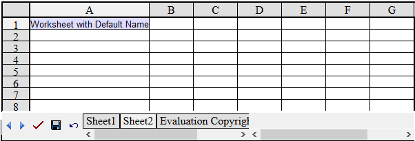

### With Specified Sheet Name

To add a worksheet with a specific name to the GridWeb control instead of using the default naming scheme, call an overloaded version of the `add` method that takes the specified string `SheetName`. For instance, the example below adds a worksheet named Invoice.

**Output: a worksheet with a specified name has been added to GridWeb**  
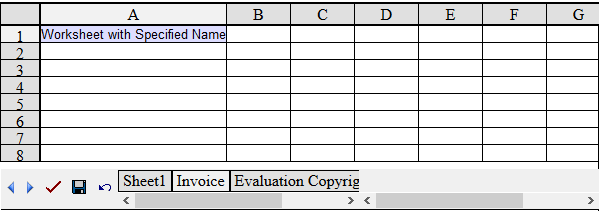

The `add()` method returns the new worksheet's index which can be used to access the instance of this worksheet. For more details on how to access worksheets, read [Accessing Worksheets](https://docs2.aspose.com/cells/java/developerguide/gridweb/working+with+worksheets+gridweb#workingwithworksheetsgridweb-accessingworksheets).

## Renaming a Worksheet

Renaming a worksheet can be very useful when working with many worksheets in GridWeb and decide to change their names to make them more meaningful. For example, a worksheet containing an invoice can be renamed Invoice instead of Sheet1. This topic describes this simple but useful feature.

### Renaming a Worksheet

All worksheets contain a `Name` property that allows developers to access or modify worksheets' names. To rename a worksheet:

1.  Access a worksheet from the `GridWorksheetCollection`.
2.  Rename the selected worksheet.

For more details on how to access worksheets in Aspose.Cells.GridWeb, please refer to [Accessing Worksheets](https://docs2.aspose.com/cells/java/developerguide/gridweb/working+with+worksheets+gridweb#workingwithworksheetsgridweb-accessingworksheets).

Before executing the code, the worksheet has a default name, such as Sheet1.

**Input file: a worksheet with a default name Sheet1**  
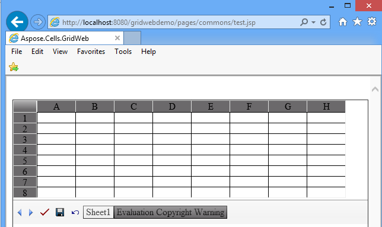

After running the code, the worksheet is renamed Invoice.

**Output: the worksheet is renamed Invoice**  
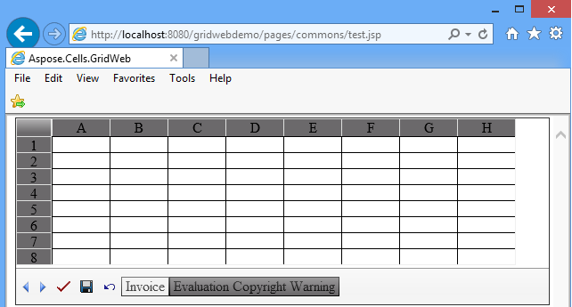

## Copying a Worksheet

[Adding Worksheets](https://docs2.aspose.com/cells/java/developerguide/gridweb/working+with+worksheets+gridweb#workingwithworksheetsgridweb-addingworksheets) describes how to add new worksheets to GridWeb. It's also possible to add a copy (or replica) of another worksheet to the Aspose.Cells.GridWeb control. This feature can be useful when identical or similar data in one worksheet is also required in another worksheet. When that's the case, it's easier to copy an existing worksheet and add it to Aspose.Cells.GridWeb as a new worksheet instead of creating it from scratch.

### Using Sheet index

The example code below shows how to add a copy of a worksheet to the GridWeb control by specifying the worksheet's index in the `GridWorksheetCollection`'s `addCopy` method.

### Using Sheet Name

The example code below shows how to add a copy of a worksheet to the GridWeb control by specifying the worksheet's name in the `GridWorksheetCollection`'s `addCopy` method.

The `addCopy` method returns the newly added worksheet's index which can be used to access the worksheet instance. For more details on how to access worksheets, read [Accessing Worksheets](https://docs2.aspose.com/cells/java/developerguide/gridweb/working+with+worksheets+gridweb#workingwithworksheetsgridweb-accessingworksheets).

## Working with Named Ranges

Normally, column and row labels are used to uniquely refer to cells. But you can create descriptive names to represent cells, ranges of cells, formulas, or constant values.

The word **name** may refer to a string of characters that represents a cell, range of cells, formula, or constant value. For example, use easy-to-understand names, such as Products, to refer to hard to understand ranges, such as Sales!C20:C30.

Labels can be used in formulas that refer to data on the same worksheet; if you want to represent a range on another worksheet, you may use a name. **Named ranges** is one of the most powerful features of Microsoft Excel.

Users can assign a name to a range and use that name in formulas. Aspose.Cells.GridWeb supports this feature.

### Adding/Referencing Named Ranges in Formulas

The GridWeb control provides two classes (`GridName` and `GridNameCollection`) for working with named ranges.

The following code snippet will help you understand how to use them.

## Managing Comments in Worksheet

This topic discusses adding, accessing and removing comments from worksheets. Comments are useful for adding notes or useful information for users who will work with the sheet. Developers have the flexibility to add comments to any cell of the worksheet.

### Working with Comments

#### Adding Comments

To add a comment to worksheet, please follow the steps below:

1.  Add the Aspose.Cells.GridWeb control to the Web Form.
2.  Access the worksheet you're adding comments to.
3.  Add a comment to a cell.
4.  Set a note for the new comment.

**A comment has been added to the worksheet**  
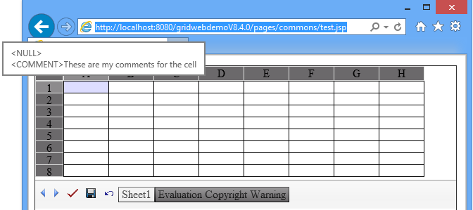

#### Accessing Comments

To access a comment:

1.  Access the cell that contains the comment.
2.  Get the cell's reference.
3.  Pass the reference to the Comment collection's to access the comment.
4.  It's now possible to modify the comment's properties.

#### Removing Comments

To remove a comment:

1.  Access the cell as explained above.
2.  Use the Comment collection's `removeAt` method to remove the comment.

## Managing Hyperlinks in Worksheet

This topic discusses what types of hyperlinks are supported in Aspose.Cells.GridWeb and how to manage them programmatically. Hyperlinks can be used for either creating links to web URLs or to perform postback to a server.

### Types of Hyperlinks

The following hyperlinks are supported by Aspose.Cells.GridWeb:

*   Text URL hyperlinks, URL hyperlinks applied to the text.
*   Image URL hyperlinks, URL hyperlinks applied to images.

#### Text URL Hyperlinks

The example below adds two hyperlinks to a worksheet. One has a \_blank target while the other is set to \_parent.

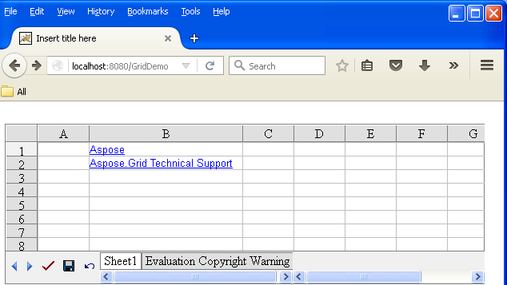

**Output: text hyperlinks added to worksheet**

#### Image URL Hyperlinks

The example below adds image URL hyperlink to a worksheet.

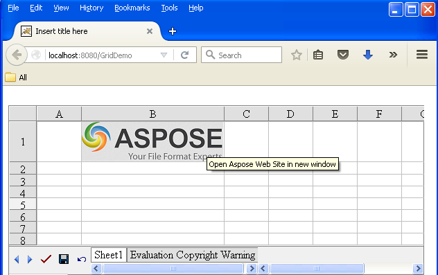

**Output: image hyperlink added to worksheet**

## Sorting Data

Sorting is a very valuable feature when it comes to data processing. Unsorted data is a pain for users when searching for specific information. Aspose.Cells.GridWeb supports powerful sorting features. This topic discusses sorting data using the Aspose.Cells.GridWeb API.

Aspose.Cells.GridWeb allows developers to sort data horizontally and vertically so that developers can sort data from top to bottom or left to right.

### From Top to Bottom

To sort data from top to bottom orientation:

1.  Add the Aspose.Cells.GridWeb control to your Web Form.
2.  Access the worksheet that you want to sort.
3.  Sort the range of data in any order (ascending or descending). Be sure to select top to bottom orientation.

The example below sorts data in two columns (Student ID and Student Name) of a worksheet in ascending order. Only twelve rows of two columns are sorted in the top to bottom orientation.

Before applying the code, the worksheet contains unordered data.

**Input: unsorted data**  
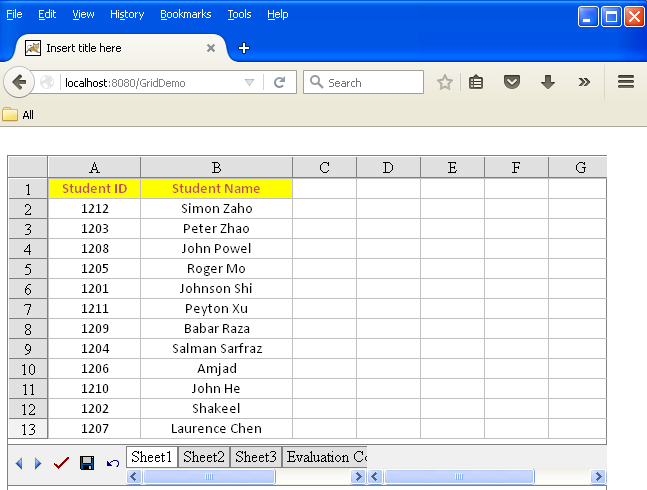

After executing the code, the data is sorted in ascending order.

**Output: data sorted from top to bottom in ascending order**  
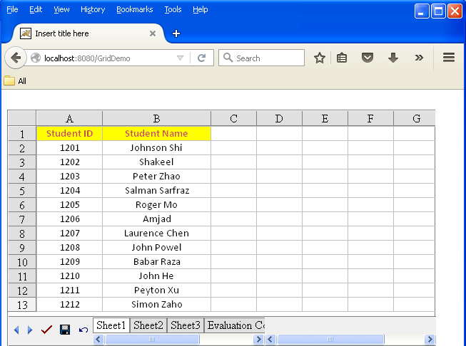

### From Left to Right

To sort data from left to right:

1.  Add the Aspose.Cells.GridWeb control to your Web Form.
2.  Access the worksheet that you want to sort.
3.  Sort the range of data in any order (ascending or descending). Be sure to select left to right.

The example below sorts data in two rows (Student ID and Student Name) in ascending order. Only two rows of four columns are sorted left to right.

Before applying the code, the worksheet contains unordered data.

**Input: unsorted data before executing the code snippet**  
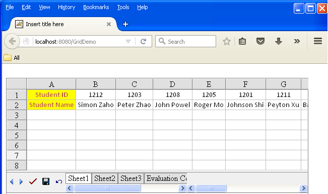

After executing the code, data is sorted in ascending order.

**Output: data sorted from left to right in ascending order**  
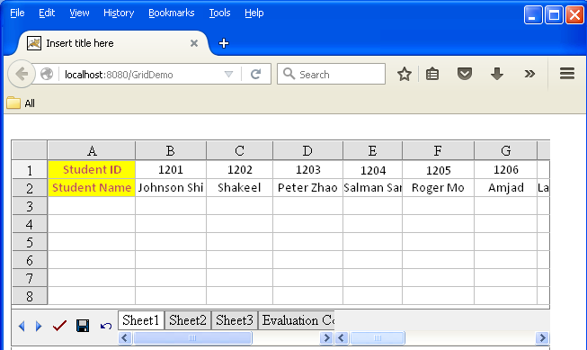

## Searching and Replacing

One of the fastest ways to make repetitive changes in a large spreadsheet is to use the find and replace feature. Find helps you locate a text string or data and replace substitutes it with a new value. Aspose.Cells.GridWeb provides this feature. It enables you to search for and replace with a specific text string or value in the worksheet client-side through a simple dialog. It even allows you to look for partial data.

### The Find/Replace Dialog

There are two ways to open the Find/Replace dialog:

1.  When the control is active, press **CTRL+F** to open the dialog, or press **CTRL+R** key to open the dialog with the **Replace** button enabled.
2.  Move the cursor to the cell area in the worksheet, then right-click. Select **Find** or **Replace** from the menu.

**Selecting Find**  
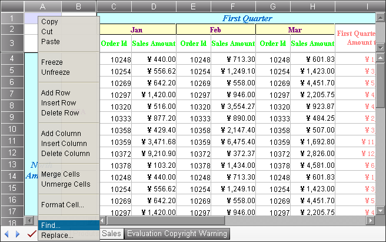

A find and replace dialog is displayed.

**The Find/Replace dialog**  

**Using Find**

To search:

1.  Open the Find/Replace dialog.
2.  Type the string you want to search for in the Find what field.
3.  Click Find Next to search.

The next cell that matches your find condition is highlighted.

If your search criterion is not found, a dialog is displayed to tell you.

### Searching Options

There are some search options that you can customize in the dialog. The table below lists them.


|No.|Option Name|Description|
|:----|:----|:----|
|1|Match case|Indicates whether to use case sensitive in searching.|
|2|Match whole word|Indicates whether to match the whole word in searching.|
|3|Search up|Indicates whether the search will be done from bottom to top.|
|4|Regular expression|When checked, the control will treat the string in the Find what text box as a regular expression in the searching process.|
|5|Find in Formulas/Values|When the Formulas is selected, the control will match the formula or unformatted value of the cells if the formula or the unformatted value is present. When the Values is selected, the control will only match the displayed value of the cells.|


### Using Replace

To replace text or values:

1.  Open the Find/Replace dialog Box by pressing **CTRL+F**, or select right-click a cell and select **Find** before clicking **Replace**.
2.  Type the replacement string in the **Replace with** field.
3.  Click **Replace**.

To replace text:

1.  Open the dialog box.
2.  Enter the text you want to find in the **Find what** field, and the text you want to replace it within the **Replace with** field.
3.  Replace one occurrence at a time by clicking **Find Next** followed by **Replace**.
4.  If you are very sure of what the worksheet contains, click **Replace All**.

If the worksheet is not in edit mode, the **Replace** button is not displayed.

