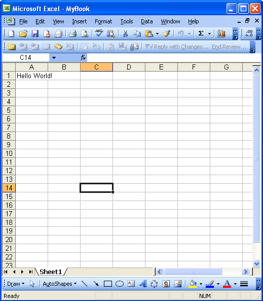

# Aspose.Cells for Java : Your First Aspose.Cells Application - Hello World


*   1 [Creating the Hello World Application](#creating-the-hello-world-application)
    *   1.1 [Creating a Workbook](#creating-a-workbook)
    *   1.2 [Opening an Existing File](#opening-an-existing-file)

 

 

This beginner's topic shows how developers can create a simple first application (Hello World) using Aspose.Cells' simple API. The application creates a Microsoft Excel file with the words Hello World in a specified cell of a worksheet.

### Creating the Hello World Application

To create the Hello World application using Aspose.Cells API:

1.  Create an instance of the [Workbook](https://apireference.aspose.com/java/cells/com.aspose.cells/workbook) class.
2.  Apply the license:
    *   If you have purchased a license, then use the license in your application to get access to Aspose.Cells' full functionality
    *   If you are using the evaluation version of the component (if you're using Aspose.Cells without a license), skip this step.
3.  Create a new Microsoft Excel file, or open an existing file in which you want to add/update some text.
4.  Access any cell of a worksheet in the Microsoft Excel file.
5.  Insert the words **Hello World!** into a cell accessed.
6.  Generate the modified Microsoft Excel file.

The examples below demonstrate the above steps.

#### Creating a Workbook

The following example creates a new workbook from scratch, writes the words "Hello World!" into cell A1 on the first worksheet, and saves the file.

**The generated spreadsheet**  

#### Opening an Existing File

The following example opens an existing Microsoft Excel template file called **book1.xls**, writes the words "Hello World!" in cell A1 in the first worksheet, and saves the workbook as a new file.

