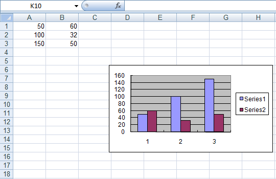
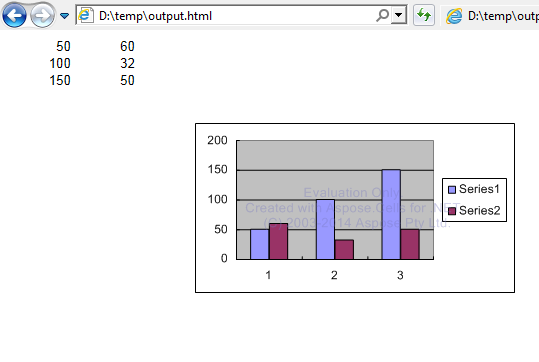

# Aspose.Cells for Java : Converting Workbook to Different Formats

Aspose.Cells supports conversion between many formats. Technically, conversion means to load a workbook in one file format and save it into another.


*   1 [Converting Excel to XPS](#converting-excel-to-xps)
    *   1.1 [Converting single Worksheet to XPS](#converting-single-worksheet-to-xps)
    *   1.2 [Export Whole Workbook to XPS](#export-whole-workbook-to-xps)
    *   1.3 [Quick Excel to XPS Conversion](#quick-excel-to-xps-conversion)
*   2 [Converting Excel to MHTML Files](#converting-excel-to-mhtml-files)
*   3 [Converting to, and from, MHTML](#converting-to,-and-from,-mhtml)
*   4 [Converting Excel Files to HTML](#converting-excel-files-to-html)
    *   4.1 [Setting Image Preferences for HTML](#setting-image-preferences-for-html)
*   5 [Converting Excel to PDF Files](#converting-excel-to-pdf-files)
    *   5.1 [Converting Excel to PDF](#converting-excel-to-pdf)
        *   5.1.1 [Direct Conversion](#direct-conversion)
        *   5.1.2 [Advanced Conversion](#advanced-conversion)
            *   5.1.2.1 [Saving Excel Spreadsheets to PDF/A Complied Files](#saving-excel-spreadsheets-to-pdf/a-complied-files)
        *   5.1.3 [Conversion with Aspose.Pdf: Aspose.Cells Prior to 2.3.0](#conversion-with-aspose.pdf:-aspose.cells-prior-to-2.3.0)
        *   5.1.4 [Conversion Attributes](#conversion-attributes)

 

## Converting Excel to XPS

The XPS document format consists of structured XML markup that defines the layout of a document and the visual appearance of each page, along with rendering rules for distributing, archiving, rendering, processing and printing documents.

The markup language for XPS is a subset of XAML which allows it to incorporate vector graphic elements in documents, using XAML to mark up the Windows Presentation Foundation (WPF) primitives. The elements used are described in terms of paths and other geometrical primitives.

An XPS file is in fact a Unicoded ZIP archive using the Open Packaging Conventions, containing the files which make up the document. These include an XML markup file for each page, text, embedded fonts, raster images, 2D vector graphics, as well as the digital rights management information. The contents of an XPS file can be examined simply by opening it in an application that supports ZIP files.

From Aspose.Cells 6.0.0, Microsoft Excel tp XPS conversion is supported.

### Converting single Worksheet to XPS

The following example shows how to convert a single worksheet in an Excel file to XPS.

### Export Whole Workbook to XPS

The following example shows how to convert the whole workbook to XPS format.

### Quick Excel to XPS Conversion

The following example shows a simple way to directly convert the Excel file to XPS format.

## Converting Excel to MHTML Files

[MHTML](http://en.wikipedia.org/wiki/Mhtml) combines normal HTML with external resources; that is, content that is usually linked in like images, animations, audio and so on into one file. They are used for emails with the .mht file extension.

Aspose.Cells supports reading and writing MHTML files.

## Converting to, and from, MHTML

Converting a spreadsheet to MHTML is a quick operation, as shown below.

The code example below shows how to save a workbook as an MHTML file.

## Converting Excel Files to HTML

The Aspose.Cells APIs provides support for exporting spreadsheets to HTML format. For this purpose, Aspose.Cells uses the [HtmlSaveOptions](https://apireference.aspose.com/java/cells/com.aspose.cells/HtmlSaveOptions) class which allows developers to control several aspects of the output HTML.

The code below demonstrates how to use the [HtmlSaveOptions](https://apireference.aspose.com/java/cells/com.aspose.cells/HtmlSaveOptions) class to export Microsoft Excel files to HTML format without specifying additional parameters.

You may achieve the same results by passing the [SaveFormat.HTML](https://apireference.aspose.com/java/cells/com.aspose.cells/saveformat#HTML) to the [Workbook.save](https://apireference.aspose.com/java/cells/com.aspose.cells/workbook#save(java.io.OutputStream,%20com.aspose.cells.SaveOptions)) method.

### Setting Image Preferences for HTML

Starting from 8.0.2, Aspose.Cells has exposed [ImageOptions](https://apireference.aspose.com/java/cells/com.aspose.cells/htmlsaveoptions#ImageOptions) for the [HtmlSaveOptions](https://apireference.aspose.com/java/cells/com.aspose.cells/HtmlSaveOptions) class, which allows developers to specify image preferences when saving spreadsheets to HTML format.

The image settings that can be applied are:

*   [ImageType](https://apireference.aspose.com/java/cells/com.aspose.cells/imageorprintoptions#ImageType): Gets or sets the image type. Please note, all shapes, including charts, render as images in the output HTML.
*   [Quality](https://apireference.aspose.com/java/cells/com.aspose.cells/imageorprintoptions#Quality): Gets or sets the quality of images between 0 to 100, when `ImageFormat` is specified as Jpeg.
*   [VerticalResolution](https://apireference.aspose.com/java/cells/com.aspose.cells/imageorprintoptions#VerticalResolution): Gets or sets the vertical resolution of the image in dots per inch.
*   [HorizontalResolution](https://apireference.aspose.com/java/cells/com.aspose.cells/imageorprintoptions#HorizontalResolution): Gets or sets the horizontal resolution of the image in dots per inch.
*   [TiffCompression](https://apireference.aspose.com/java/cells/com.aspose.cells/imageorprintoptions#TiffCompression): Gets or sets the compression type for the images when `ImageFormat` is specified as Tiff.
*   [Transparent](https://apireference.aspose.com/java/cells/com.aspose.cells/imageorprintoptions#Transparent): Indicates if the background of an image should be transparent when `ImageFormat` is specified as Png.

The code below demonstrates how to use [HtmlSaveOptions.ImageOptions](https://apireference.aspose.com/java/cells/com.aspose.cells/htmlsaveoptions#ImageOptions) to specify different preferences.


|Spreadsheet view before export|HTML view after export|
|:----|:----|
|||


## Converting Excel to PDF Files

PDF documents are widely used as a standard format of exchanging documents between organizations, government sectors, and individuals. Software developers are often asked to device a way to easily convert Microsoft Excel files into PDF documents. Aspose.Cells supports these features. This article shows how.

### Converting Excel to PDF

Microsoft Excel to PDF conversion was introduced with Aspose.Cells for Java 2.3.0. From that release, Aspose.Cells can [convert spreadsheets to PDF directly](https://docs2.aspose.com/cells/java/developerguide/ld-sv-cvt-mng/converting+workbook+to+different+formats) (including [PDF/A](https://docs2.aspose.com/cells/java/developerguide/ld-sv-cvt-mng/converting+workbook+to+different+formats)), without another product. To convert spreadsheets with older versions of Aspose.Cells, [use Aspose.PDF for the conversion](https://docs2.aspose.com/cells/java/developerguide/ld-sv-cvt-mng/converting+workbook+to+different+formats).

Aspose.Cell's converts spreadsheets to PDF with a high degree of accuracy and fidelity. However, there are a few [limitations](https://docs2.aspose.com/cells/java/developerguide/ld-sv-cvt-mng/converting+workbook+to+different+formats), listed at the end of this article.

Aspose.Cells for Java directly writes the information about API and Version Number in output documents. For example, upon rendering Document to PDF, Aspose.Cells for Java populates **Application** field with value 'Aspose.Cells' and **PDF Producer** field with a value, e.g 'Aspose.Cells for Java v17.9'.

Please note that you cannot instruct Aspose.Cells for Java to change or remove this information from output Documents.

#### Direct Conversion

Save an Excel file directly to PDF using the [Workbook.save](https://apireference.aspose.com/java/cells/com.aspose.cells/workbook#save(java.io.OutputStream,%20com.aspose.cells.SaveOptions)) method, and provide the [SaveFormat.PDF](https://apireference.aspose.com/java/cells/com.aspose.cells/saveformat#PDF) interface member. Direct conversion like this is the most efficient conversion method. It does not lose data or formatting but keeps the output PDF looking like the input Excel file.

To specify security options when saving to PDF, use [PdfSaveOptions](https://apireference.aspose.com/java/cells/com.aspose.cells/PdfSaveOptions).

#### Advanced Conversion

You may also opt to use the [PdfSaveOptions](https://apireference.aspose.com/java/cells/com.aspose.cells/PdfSaveOptions) class to set different attributes for the conversion. Setting different properties of [PdfSaveOptions](https://apireference.aspose.com/java/cells/com.aspose.cells/PdfSaveOptions) class will give you the control over the Print, Font, Security and Compression settings for the resultant PDF file. Most notable property is the [Compliance](https://apireference.aspose.com/java/cells/com.aspose.cells/pdfsaveoptions#Compliance) that enables you to save the Excel files to PDF/A compliant PDF files.

##### Saving Excel Spreadsheets to PDF/A Complied Files

Below provided code snippet demonstrates the usage of the [PdfSaveOptions](https://apireference.aspose.com/java/cells/com.aspose.cells/PdfSaveOptions) class to save the Excel files to PDF/A compliant PDF format.

  

#### Conversion with Aspose.Pdf: Aspose.Cells Prior to 2.3.0

For Aspose.Cells versions prior to version 2.3.0 you need to use a component like [Aspose.PDF for Java](https://docs.aspose.com/display/pdfjava/Introducing+Aspose.PDF+for+Java) to convert spreadsheets to PDF files. Aspose.Cells and Aspose.PDF work together to convert a spreadsheet to PDF via an intermediate step.

To convert spreadsheets to PDF with Aspose.Cells and Aspose.PDF:

1.  Instantiate an object of the [Workbook](https://apireference.aspose.com/java/cells/com.aspose.cells/Workbook) class by calling its empty constructor.
2.  Do your desired work on the spreadsheet using the Aspose.Cells API.
3.  Call the [Workbook.save](https://apireference.aspose.com/java/cells/com.aspose.cells/workbook#save(java.io.OutputStream,%20com.aspose.cells.SaveOptions)) method to save the spreadsheet:
    1.  Set the file format to XML.
    2.  Select `Aspose_Pdf` (a pre-defined value) from the `FileFormatType` interface. This directs the `save` method to generate a spreadsheet in the XML form compatible with the Aspose.PDF Schema so that Aspose.PDF for Java can then generate a PDF document.
4.  When the XML file has been created, create an object of the `Pdf` class in the `aspose.pdf` package.
5.  Call the `Pdf` class' `bindXML` method and pass the name of the output XML file.
6.  Call the `Pdf` class' `save` method to generate the PDF document.

The above steps are implemented below in an example.

If your spreadsheet contains formulas, it is best to call [Workbook.calculateFormula](https://apireference.aspose.com/java/cells/com.aspose.cells/workbook#calculateFormula()) method just before rendering the spreadsheet to PDF format. Doing so will ensure that the formula dependent values are recalculated, and the correct values are rendered in the PDF.

#### Conversion Attributes

We work hard to improve conversion and other aspects of Aspose.Cells with every release. Excel to PDF conversion has a few limitations. Some format settings specified in a spreadsheet might be lost, and not all drawing objects are supported.

The table below lists all features that are fully or partially supported when exporting to PDF using Aspose.Cells. This table is not final and does not cover all the spreadsheet attributes. It can also identify those features that may not be supported or are partially supported for the conversion.


|Document Element|Attribute|Net Supported|Notes|
|:----|:----|:----|:----|
|Alignment| |Yes| |
|Rotation| |Partially|Only supports 90 and -90.|
|Background settings| |Yes| |
|Border|Color|Yes| |
|Border|Line style|Yes| |
|Border|Line width|Yes| |
|Cell Data| |Yes| |
|Comments| |No| |
|Conditional Formatting| |Yes| |
|Document Properties| |Yes| |
|Drawing Objects| |Yes| |
|Font|Size|Yes| |
|Font|Color|Yes| |
|Font|Style|Yes| |
|Font|Underline|Yes| |
|Font|Effects|Partially|Only the strike-through effect is supported|
|Images| |Yes| |
|Hyperlink| |Yes| |
|Charts| |Yes| |
|Merged Cells| |Yes| |
|Page Break| |Yes| |
|Page Setup|Header/Footer|Yes| |
|Page Setup|Margins|Yes| |
|Page Setup|Page Orientation|Yes| |
|Page Setup|Page Size|Yes| |
|Page Setup|Print Area|Yes| |
|Page Setup|Print Titles|Yes| |
|Page Setup|Scaling|Yes| |
|Row Height/Column Width| |Yes| |


