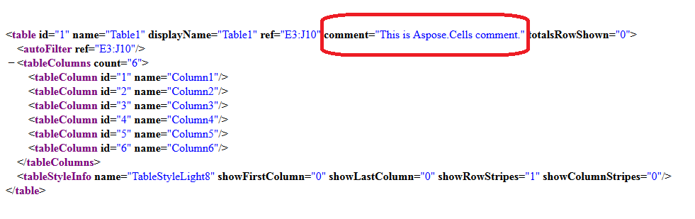

# Aspose.Cells for Java : Set the Comment of Table or List Object


*   1 [Set the Comment of Table or List Object inside the Worksheet](#set-the-comment-of-table-or-list-object-inside-the-worksheet)

 

 

#### Set the Comment of Table or List Object inside the Worksheet

Please set the comment of the Table or List Object inside the worksheet using the [ListObject.Comment](https://apireference.aspose.com/java/cells/com.aspose.cells/listobject#Comment) property. The comment will be visible inside the `xl/tables/tableName.xml` file.

The following sample code loads the [source excel file](https://docs2.aspose.com/cells/java/attachments/5276080/5472561.xlsx), sets the comment of the first table or list object inside the worksheet and the screenshot shows the comment created by this code in the red rectangle.

