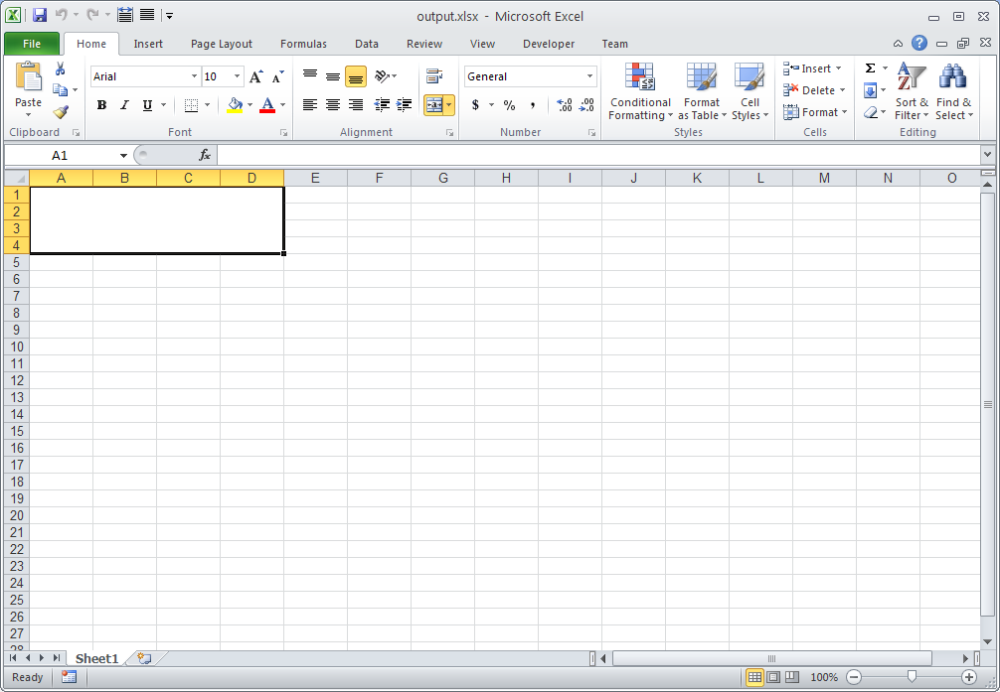

# Aspose.Cells for Java : Merge or Unmerge Range of Cells

You can use Aspose.Cells to merge or split a range of cells. Aspose.Cells provides the [Range.merge()](https://apireference.aspose.com/java/cells/com.aspose.cells/range#merge()) and [Range.unMerge()](https://apireference.aspose.com/java/cells/com.aspose.cells/range#unMerge()) methods for this purpose. This article explains how to merge a range of cells into a single cell.

The following sample code first creates a range - A1:D4 - and then merges the cells in the range into a single cell using the [Range.merge()](https://apireference.aspose.com/java/cells/com.aspose.cells/range#merge()) method.  
Similarly, it is possible to split cells by creating a range and calling the [Range.unMerge()](https://apireference.aspose.com/java/cells/com.aspose.cells/range#unMerge()) method.

The following image shows the output Excel file generated with the sample code. As you can see, the range A1:D4 has been merged into a single cell.

#### Related Articles

*   [Merging and splitting cells](https://docs2.aspose.com/cells/java/developerguide/data/merging+and+unmerging+cells).

