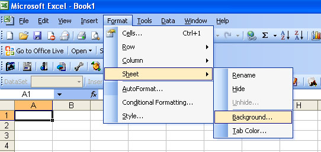

# Aspose.Cells for Java : Set Background Picture for a Worksheet

You can make a worksheet more appealing by adding a picture as a sheet background. This feature can be quite effective if you have a special corporate graphic that adds a hint of the background without obscuring the data on the sheet. You can set the background picture for a sheet using Aspose.Cells API.

#### Setting Sheet Background in Microsoft Excel

To set a sheet's background image in Microsoft Excel (for example, Microsoft Excel 2003):

1.  From the **Format** menu, select **Sheet**, and then select the **Background** option.
2.  Select a picture to set the sheet's background picture.  
    **Setting a sheet background**  
    

#### Setting Sheet Background with Aspose.cells

The code below sets a background image using an image from a stream.

