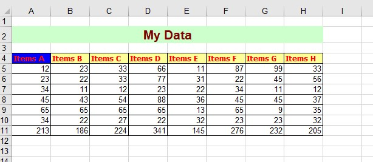
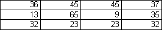

# Aspose.Cells for Java : Export Range of Cells in a Worksheet to Image

You can make an image of a worksheet using Aspose.Cells. However, sometimes you need to export only a range of cells in a worksheet to an image. This article explains how to achieve this.

To take an image of a range, set the print area to the desired range and then set all margins to 0. Also set [ImageOrPrintOptions.setOnePagePerSheet()](https://apireference.aspose.com/java/cells/com.aspose.cells/imageorprintoptions#OnePagePerSheet) to **true**.

The following code takes an image of the range E8:H10. Below is a screenshot of the source workbook used in the code. You can try the code with any workbook.

**Input file**  

Executing the code creates an image of the range E8:H10 only.

**Output image**  

