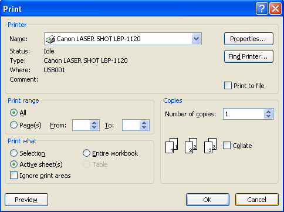

# Aspose.Cells for Java : Printing Workbooks

This document is designed to provide the developers with understanding (in a compact manner) on how to print spreadsheets.

After you finish creating your spreadsheet, you will probably want to print a hard copy of the sheet for your need. When you are printing, MS Excel assumes you want to print the entire worksheet area unless you specify your selection. In this document, we have provided the simplest lines of code using **Aspose.Cells API** to perform the task for you.  
  

**Figure:** Print Dialog Box

The component provides [SheetRender.toPrinter](https://apireference.aspose.com/java/cells/com.aspose.cells/sheetrender#toPrinter(java.lang.String)) method to print a worksheet for your requirement.

##### *Code Snippet*

Please see the following sample code to find how you can print your selected worksheet.

  
The developers can also use [WorkbookRender.toPrinter](https://apireference.aspose.com/java/cells/com.aspose.cells/workbookrender#toPrinter(java.lang.String)) method to print the whole workbook. Please see the following sample code to find how you can print the whole workbook.

