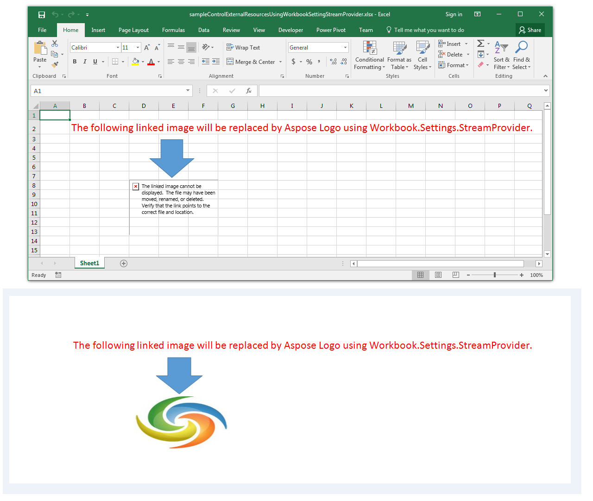

# Aspose.Cells for Java : Control External Resources using WorkbookSetting.StreamProvider


*   1 [Possible Usage Scenarios](#possible-usage-scenarios)
*   2 [Control External Resources using WorkbookSetting.StreamProvider](#control-external-resources-using-workbooksetting.streamprovider)
*   3 [Sample Code](#sample-code)

 

## Possible Usage Scenarios

Sometimes, your Excel file contains external resources e.g. linked images, etc. Aspose.Cells allows you to control these external resources using [Workbook.Settings.StreamProvider](https://apireference.aspose.com/java/cells/com.aspose.cells/workbooksettings#StreamProvider) which takes the implementation of [IStreamProvider](https://apireference.aspose.com/java/cells/com.aspose.cells/IStreamProvider) interface. Whenever you will try to render your worksheet containing external resources e.g. linked images, the methods of [IStreamProvider](https://apireference.aspose.com/java/cells/com.aspose.cells/IStreamProvider) interface will be invoked which will enable you to take appropriate actions for your external resources.

## Control External Resources using WorkbookSetting.StreamProvider

The following sample code explains the usage of [Workbook.Settings.StreamProvider](https://apireference.aspose.com/java/cells/com.aspose.cells/workbooksettings#StreamProvider). It loads the [sample Excel file](https://docs2.aspose.com/cells/java/attachments/61542617/61767877.xlsx) containing a linked image. The code replaces the linked image with [Aspose Logo](https://docs2.aspose.com/cells/java/attachments/61542617/61767874.png) and renders the entire sheet into a single image using [SheetRender](https://apireference.aspose.com/java/cells/com.aspose.cells/SheetRender) class. The following screenshot shows the sample Excel file and its [rendered output image](https://docs2.aspose.com/cells/java/attachments/61542617/61767874.png) for a reference. As you can see, the broken linked image is replaced with Aspose Logo.

## Sample Code

