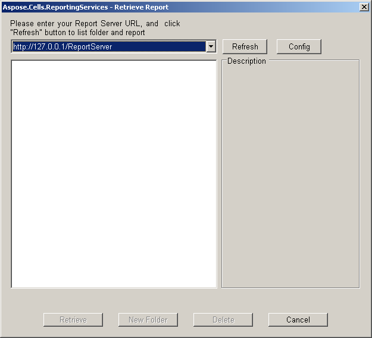
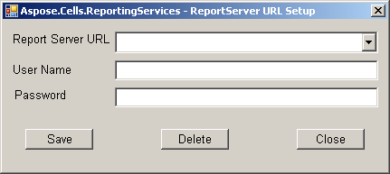

# Aspose.Cells for Reporting Services : Configuring Aspose.Cells.ReportingServices Client Report Server URL

To configure a client Report Server URL:

1.  Click the **Open Remote Report** button and get the **Retrieve Report** dialog box.  
      
    
2.  Click the **Config** button and get **Report Server URL Setup** dialog.  
      
    
3.  Input report server configuration information (URL, user name and password).
    *   The Report Server URL must be in the format ‘[http://host/ReportServer](http://host/ReportServer)’. For example [http://172.16.204.11/ReportServer](http://172.16.204.11/ReportServer).
    *   The user name is the Window Server user name. For example, Administrator.
    *   The password is the Window Server user password. For example, 123456.
    *   The default value of the Domain is null.
4.  Click the **Test** button to check configuration information.
5.  Click **Save** and save the report server configuration information.  
      
      
      
    
6.  Click **Modify** button to modify configuration information.

