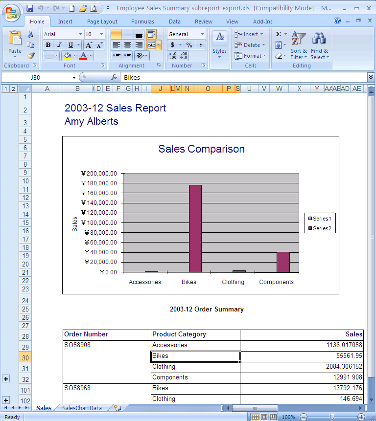
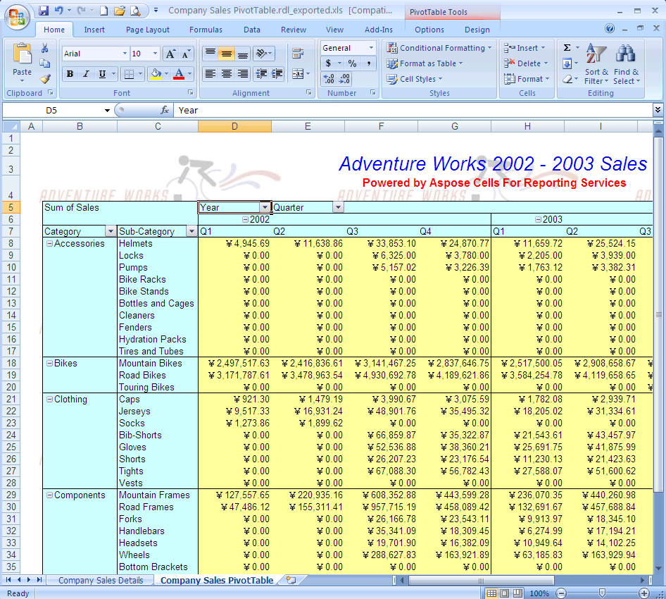

# Aspose.Cells for Reporting Services : More Excel File Formats Export

Aspose.Cells for Reporting Services allows you to deliver native Microsoft Excel reports through Microsoft SQL Server 2005 and 2008 Reporting Services. Unlike the built-in renderer for Microsoft Excel-based reports, Aspose.Cells for Reporting Services provides an extended feature set that convert RDL reports to: Excel 97-2003 binary XLS format, CSV, SpreadsheetML, Excel 2007 XLSX , Excel 2007 XLSM, Excel 2007 XLSB, HTML and ODS format.  

Aspose.Cells for Reporting Services supports more file formats than the native exporters. Below, are screenshots from sample XLS reports exported with Aspose.Cells.

**A Sample XLS report is exported using Aspose.Cells for Reporting Services**  

**A Sample Pivot Table XLS report is generated using Aspose.Cells for Reporting Services**  

