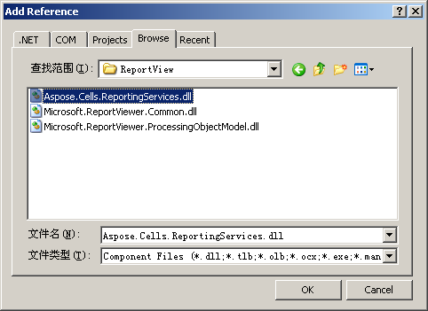
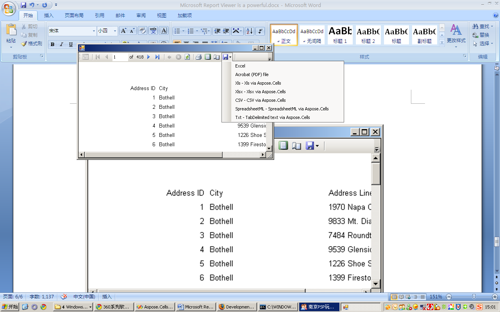

# Aspose.Cells for Reporting Services : Integrate with Microsoft Report Viewer in Local Mode

Microsoft Report Viewer is a powerful .NET control that allows RDL and RDLC reports to be used in WinForms and ASP.NET applications. It enables users to view and export reports to different formats. The control is included with Microsoft Visual Studio 2005 and 2008, and is also available as a free download from Microsoft.

Report Viewer can generate reports independently using a built-in engine (known as 'local mode'), or it can display reports that are generated on a Microsoft SQL Server Reporting Services Report Server ('remote mode'):

*   In remote mode, Report Viewer can export reports to all formats installed on the Report Server to which it is connected. Therefore, to export reports to more Microsoft Excel formats you only need to install Aspose.Cells for Reporting Services on the server.
*   In local mode however, Report Viewer does not connect to a Report Server and the list of export formats is limited to only a few built-in formats.

By installing Aspose.Cells for Reporting Services on a development machine and following the steps below, you can export to more Microsoft Excel formats from Report Viewer working in local mode.

### Working with Aspose.Cells in Local Mode

1.  Reference **Aspose.Cells.ReportingServices.dll** in the project:
    1.  Open the project in Visual Studio.
    2.  Right-click the **References** folder and select **Add Reference**.
    3.  Select the **Browse** tab and browse to the following assembly:  
        `<InstallDir>/ ReportView/Aspose.Cells.ReportingServices.dll`  
        (where `<InstallDir>` is the directory where you installed or unpacked Aspose.Cells for Reporting Services.  
          
        **Adding a reference to Aspose.Cells.ReportingServices.dll to a project**  
          
          
        
2.  Copy and paste the following `AddExtension` method into the project.  
    This method adds the specified rendering extension to the list of supported extensions in Microsoft Report Viewer using private reflection.  
    
    **C#**
    

 
using System.Collections;
using System.Reflection;
using Microsoft.ReportingServices.ReportRendering;
// Use one of the two namespaces below depending on whether you are developing
// a WinForms or WebForms application.
using Microsoft.Reporting.WinForms;
// -- or --
// using Microsoft.Reporting.WebForms;
 
 
/// 

/// Adds the specified rendering extension to the specified ReportViewer instance.
/// 

/// <param name="viewer">A ReportViewer control instance.</param>
/// <param name="formatName">The name of the export format to appear on the dropdown list.</param>
/// <param name="extensionType">The class of the rendering extension to add.</param>
private static void AddExtension(ReportViewer viewer, string formatName, Type extensionType)
{
const BindingFlags flags = BindingFlags.NonPublic | BindingFlags.Public | BindingFlags.Instance;
// CommonService.ListRenderingExtension is an internal method that returns a list of supported
// rendering extensions. This list is also stored in a class field so we can simply get this list
// and add Aspose.Cells for Reporting Services rendering extensions to make Microsoft Excel
// export formats appear on the dropdown.
// Get the service type.
FieldInfo previewService = viewer.LocalReport.GetType().GetField("m_previewService", flags);
// Get the ListRenderingExtensions method info.
MethodInfo listRenderingExtensions = previewService.FieldType.GetMethod("ListRenderingExtensions", flags);
// Obtan a list of existing rendering extensions.
IList extensions = listRenderingExtensions.Invoke(previewService.GetValue(viewer.LocalReport), null) as IList;
// LocalRenderingExtensionInfo is a class that holds information about a rendering extension.
// We should create an instance of this class to add the info about the specified extension.
// Since the IRenderingExtension interface is defined in the Microsoft.ReportViewer.Common
// assembly, use this trick to obtain the corresponding Assembly instance. This will work for
// both Report Viewer 2005 (8.0) and 2008 (9.0).
Assembly commonAssembly = typeof(IRenderingExtension).Assembly;
// Now, get the LocalRenderingExtensionInfo type as it is defined in the same assembly.
Type localRenderingExtensionInfoType = commonAssembly.GetType("Microsoft.Reporting.LocalRenderingExtensionInfo");
// Get the LocalRenderingExtensionInfo constructor info.
ConstructorInfo ctor = localRenderingExtensionInfoType.GetConstructor(flags,
null,
new Type[] { typeof(string), typeof(string), typeof(bool), typeof(Type), typeof(bool) },
null);
// Create an instance of LocalRenderingExtensionInfo.
object instance = ctor.Invoke(new object[] { formatName, formatName, true, extensionType, true });
// Finally, add the info about our rendering extension to the list.
extensions.Add(instance);
}
 

    
      
      
    
    **VB .NET**
    
     Imports System.CollectionsImports System.ReflectionImports Microsoft.ReportingServices.ReportRendering// Use one of the two namespaces below depending on whether you are developing// a WinForms or WebForms application.Imports Microsoft.Reporting.WinForms// -- or --// Imports Microsoft.Reporting.WebForms  '' Adds the specified rendering extension to the specified ReportViewer instance.Private Shared Sub AddExtension(ByVal viewer As ReportViewer, ByVal formatName As String, ByVal extensionType As Type)    Const flags As BindingFlags = BindingFlags.NonPublic Or BindingFlags.Public Or BindingFlags.Instance     ' CommonService.ListRenderingExtension is an internal method that returns a list of supported    ' rendering extensions. This list is also stored in a class field so we can simply get this list    ' and add Aspose.Cells for Reporting Services rendering extensions to make Microsoft Excel    ' export formats appear on the dropdown.     ' Get the service type.    Dim previewService As FieldInfo = viewer.LocalReport.GetType().GetField("m\_previewService", flags)     ' Get the ListRenderingExtensions method info.    Dim listRenderingExtensions As MethodInfo = previewService.FieldType.GetMethod("ListRenderingExtensions", flags)     ' Obtan a list of existing rendering extensions.    Dim extensions As IList = TryCast(listRenderingExtensions.Invoke(previewService.GetValue(viewer.LocalReport), Nothing), IList)     ' LocalRenderingExtensionInfo is a class that holds information about a rendering extension.    ' We should create an instance of this class to add the info about the specified extension.     ' Since the IRenderingExtension interface is defined in the Microsoft.ReportViewer.Common assembly, use this trick    ' to obtain the corresponding Assembly instance. This will work for both Report Viewer 2005 (8.0) and 2008 (9.0).    Dim commonAssembly As System.Reflection.Assembly = GetType(IRenderingExtension).Assembly     ' Now, get the LocalRenderingExtensionInfo type as it is defined in the same assembly.    Dim localRenderingExtensionInfoType As Type = commonAssembly.GetType("Microsoft.Reporting.LocalRenderingExtensionInfo")     ' Get the LocalRenderingExtensionInfo constructor info.    Dim ctor As ConstructorInfo = localRenderingExtensionInfoType.GetConstructor(flags, Nothing, New Type() { GetType(String), GetType(String), GetType(Boolean), GetType(Type), GetType(Boolean) }, Nothing)     ' Create an instance of LocalRenderingExtensionInfo.     Dim instance As Object = ctor.Invoke(New Object() { formatName, formatName, True, extensionType, True })     ' Finally, add the info about our rendering extension to the list.    extensions.Add(instance)End Sub 
    
3.  Invoke the `AddExtension` method from the code.
    *   You can call `AddExtension` (shown in the previous step) whenever you need to add Aspose.Cells for Reporting Services export formats to a Report Viewer control instance. Consider calling from the `Form_Load` or `Page_Load` event handler of a WinForms or ASP .NET application.
    *   You can add all or only some export Aspose.Cells for Reporting Services export formats. You can specify any display name for the formats to appear in Report Viewer.  
        To add Aspose.Cells for Reporting Services export formats to Microsoft Report Viewer in local mode, use the following code:  
          
        
        **C#**
        
                     AddExtension(reportViewer1, "Xls - Xls via Aspose.Cells",    typeof(Aspose.Cells.ReportingServices.XlsRenderer));            AddExtension(reportViewer1, "Xlsx - Xlsx via Aspose.Cells", typeof(Aspose.Cells.ReportingServices.Excel2007XlsxRenderer));			AddExtension(reportViewer1, "CSV - CSV via Aspose.Cells",    typeof(Aspose.Cells.ReportingServices.CSVRenderer));            AddExtension(reportViewer1, "SpreadsheetML - SpreadsheetML via Aspose.Cells", typeof(Aspose.Cells.ReportingServices.SpreadsheetMLRenderer));            AddExtension(reportViewer1, "Txt - TabDelimited text via Aspose.Cells", typeof(Aspose.Cells.ReportingServices.TabDelimitedRenderer));  
        
        **VB .NET**
        
                     AddExtension(reportViewer1, "Xls - Xls via Aspose.Cells",    GetType (Aspose.Cells.ReportingServices.XlsRenderer));            AddExtension(reportViewer1, "Xlsx - Xlsx via Aspose.Cells", GetType (Aspose.Cells.ReportingServices.Excel2007XlsxRenderer));			AddExtension(reportViewer1, "CSV - CSV via Aspose.Cells",    GetType (Aspose.Cells.ReportingServices.CSVRenderer));            AddExtension(reportViewer1, "SpreadsheetML - SpreadsheetML via Aspose.Cells", GetType (Aspose.Cells.ReportingServices.SpreadsheetMLRenderer));            AddExtension(reportViewer1, "Txt - TabDelimited text via Aspose.Cells", GetType (Aspose.Cells.ReportingServices.TabDelimitedRenderer)); 
        
4.  Test the new export formats.
    1.  Run your application.  
        You should notice a number of new export formats available in the **Export** menu in Report Viewer.
    2.  Select one of the formats and run export.
    3.  Verify that the document is created the way you expected.

**New export formats appear in Report Viewer running in local mode**  

