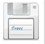
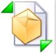
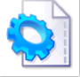

# Aspose.Cells for Reporting Services : Command Bars

The following table shows the command bars icons and tools on Aspose.Cells.Report.Designer add-in's toolbar.


|Command|Image|Description|
|:----|:----|:----|
|Open Local Report||Opens an RDL file from local PC and loads the file context.|
|Open Remote Report||Opens an RDL file from Report Server and loads the file context.|
|Save Report||Saves designing report locally or on the server.|
|Publish Report||Uploads the RDL file on the server.|
|View Report||Displays a preview of the report from the server.|
|Build DataSet and Data Source||Builds datasets and data sources.|
|Modify Report Parameter||Modifies report parameter and query parameter relation.|
|Insert Formula||Inserts formula into the cell through the formula editor windows|
|Set Attribute||Sets some of the report attributes: report name, report range, group fields, order fields and so on.|
|Modify Attribute||Modifies some of the report attributes: report name, report range, group fields, order fields and so on.|
|Set Footer||Inserts '##footer' into the cell.|


