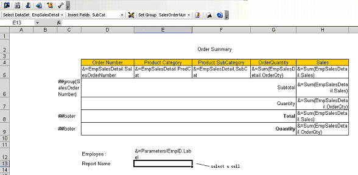

# Aspose.Cells for Reporting Services : Adding Reporting Services Global Variables to Report

Aspose.Cells' report template supports Reporting Services' global variables as a data source for cells that contain a Reporting Services global variables marker.

[Aspose.Cells Template and Smart Markers](https://docs2.aspose.com/cells/reportingservices/userguide/aspose.cells+template+and+smart+markers) explains how Reporting Services Global Variables markers work. Global variables are normally placed in the text area of a table header or footer.

To add global variables to reports:

1.  Select a cell.  
      
    **A selected cell**  
      
      
    
2.  Click **Insert formula** on the Aspose.Cells.Report.Designer toolbar ().
3.  Select **Globals** in the left panel.  
    All global variables are listed to the right.
4.  Select **ReportName** and double-click.  
    The expression appears in the **Edit** box at the top.  
      
    **Selecting a global variable**  
      
      
    
5.  Click **OK** to finish.  
    The cell now contains a global variable marker.  
      
    **A global variables marker in a cell**  
    

