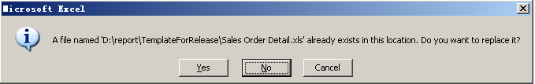

# Aspose.Cells for Reporting Services : Publishing Report

When you have designed a report with all the elements you want it to have, the next step is to publish it to the Reporting Server so that you, and your colleagues, can run it.

To publish a report to Report Server, follow the steps below:

1.  Click **Publish**  on the Aspose.Cells.Report.Designer toolbar and click the **Yes** button to save the report.  
      
      
      
    
2.  In the dialog box, enter the URL of the Report Server and click the **Refresh** button.  
      
    
3.  Select a target folder and enter the report name. Click the **DataSource Setup** button to setup data sources.  
      
      
      
    The DataSource Setup dialog is displayed.
4.  In the dialog box, enter the data source information. Click **Select** to select the shared data sources. (If you require them, the shared data sources should be the report's prime data source). Click the **OK** button to complete the work.  
      
    
5.  Click **Publish** to publish the report to Report Server.  
      
    

button to complete the work.

