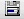

# Aspose.Cells for Reporting Services : Saving Reports

To save a report, click **Save Report** on the Aspose.Cells.Report.Designer toolbar ().  
The report (Microsoft Excel template) is saved as an RDL file.

