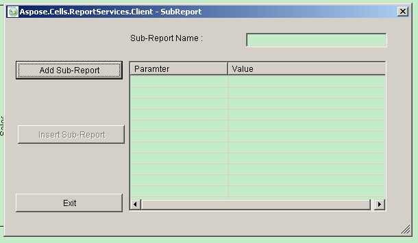
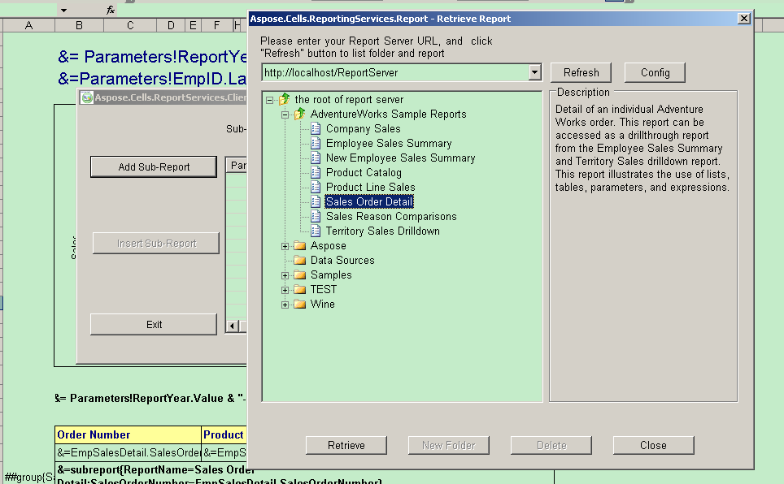
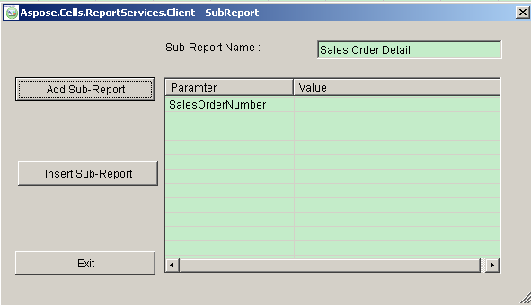
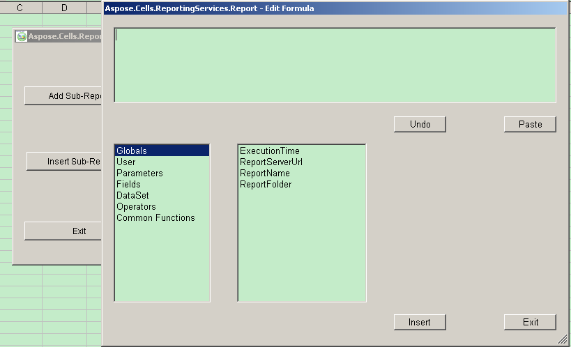

# Aspose.Cells for Reporting Services : Add Sub Report Item

To add sub-report item:

1.  Select the cell that will reference the sub-report item.
2.  Click **Sub-Report** ().  
    The sub-report form is shown.  
      
    **The SubReport form**  
      
      
    
3.  Click **Add Sub-Report**.  
    The Retrieve Report form is displayed.
4.  Select a report.  
      
    **Selecting a report**  
      
      
    
5.  Click **Close**.  
      
    **A sub-report has been selected**  
      
      
    
6.  Double-click the parameter list to show the Edit Formula dialog.  
      
    **The Edit Formula dialog**  
      
      
    
7.  Edit and/or update a parameter value.  
      
    **Naming the sub-report**  
      
      
    
8.  Click **Insert Sub-Report**.  
      
    **The sub-report inserted into a report table**  
    

