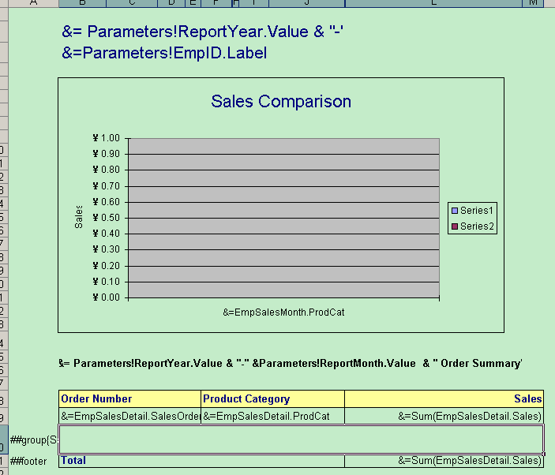

# Aspose.Cells for Reporting Services : Creating Table Item

To create new table item, follow the steps described in [Creating a New Table](/pages/createpage.action?spaceKey=cellsreportingservices&title=Creating+a+New+Table&linkCreation=true&fromPageId=6094961).  
Following is an example report table.

  

