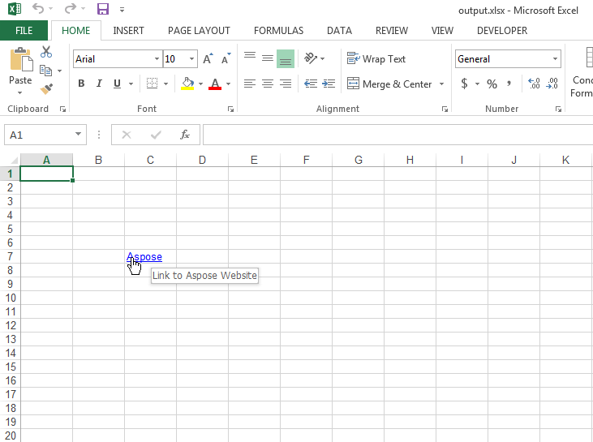

## **Add Hyperlinks to the Cells**
The following sample code shows how to add a hyperlink inside the cell of the worksheet. You can also add a hyperlink in a range of cells in a similar way. Please check the [output excel file](23167002.xlsx) generated with this code and the following screenshot showing the output excel file in Microsoft Excel.

## **Sample Code**

