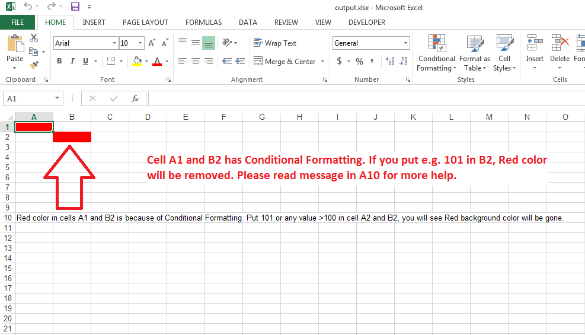

## **Possible Usage Scenario**
Aspose.Cells allows you to add all sorts of Conditional Formatting e.g. Formula, Above Average, Color Scale, Data Bar, Icon Set, Top10, etc. It provides the [IFormatCondition](https://reference.aspose.com/cells/cpp/class/aspose.cells.i_format_condition) class which has all the necessary methods to apply conditional formatting of your choice. Here is the list of a few of Get methods.

- [GetIAboveAverage()](https://reference.aspose.com/cells/cpp/class/aspose.cells.i_format_condition#aff550fd834cd78967ec440492ff012d5)
- [GetIColorScale()](https://reference.aspose.com/cells/cpp/class/aspose.cells.i_format_condition#a3348a7c447dc564ceabc22c9c89bd6f5)
- [GetIDataBar()](https://reference.aspose.com/cells/cpp/class/aspose.cells.i_format_condition#a4415a87833c41386ed1595e742485e07)
- [GetIIconSet()](https://reference.aspose.com/cells/cpp/class/aspose.cells.i_format_condition#a011b2c7dbaaf671819d09f5d1df865e3)
- [GetITop10()](https://reference.aspose.com/cells/cpp/class/aspose.cells.i_format_condition#a64388aaf1b43811f5ee1ee3090c9bd4a)
## **Apply Conditional Formatting in Worksheet**
The following sample code shows how to add a Cell Value conditional formatting on cells A1 and B2. Please see the [output excel file](23167004.xlsx) generated by the code and the following screenshot which explains the effect of the code on the [output excel file](23167004.xlsx). If you will put some value greater than 100 in cell A2 and B2, the Red fill color from cell A1 and B2 will disappear.

## **Sample Code**

