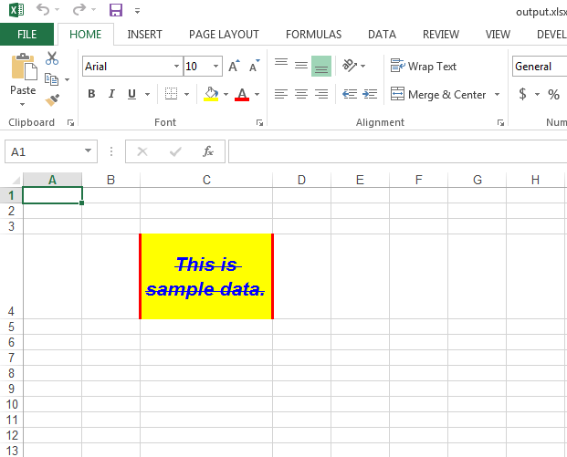

## **Format Cell or Range of Cells**
If you want to format cell or range of cells, then Aspose.Cells provides the [IStyle](https://apireference.aspose.com/cells/cpp/class/aspose.cells.i_style/) class. You can accomplish all the formatting of the cell or range of cells using this class. Some of the things relating to formatting that can be accomplished with [IStyle](https://apireference.aspose.com/cells/cpp/class/aspose.cells.i_style/) class are following

- Set fill color of the cell
- Set the text wrap of the cell
- Set the borders of the cells like the top, left, bottom and right borders, etc.
- Set the font color, font size, font name, strike, bold, italic, underline, etc.
- Set the text horizontal or vertical alignment to right, left, top, bottom, center, etc.

If you want to set the style of a single cell then please use [ICell->SetIStyle()](https://apireference.aspose.com/cells/cpp/class/aspose.cells.i_cell#afa3d5b2aa5e90b286effc9e92de59dd5) method and if you want to set the style of a range of cells, then please use [IRange->ApplyIStyle()](https://apireference.aspose.com/cells/cpp/class/aspose.cells.i_range/#aaad6703b803565b674999bbaf5eed3a0) method.
## **Sample Code**
The following sample code formats the cell C4 of the worksheet in various ways and the screenshot shows the [output excel file](21266438.xlsx) generated by it for your reference.


