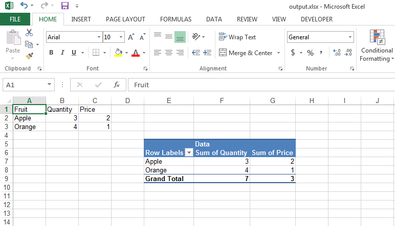

## **Introduction**
Please use [IPivotTableCollection.Add()](https://apireference.aspose.com/cpp/cells/class/aspose.cells.pivot.i_pivot_table_collection/#a903a0eb3d7ef995c370f4a4385b25111) method to create a pivot table inside the worksheet. Once, the pivot table is created, you can work with it using the [IPivotTable](https://apireference.aspose.com/cpp/cells/class/aspose.cells.pivot.i_pivot_table/) class.
## **Create Pivot Table**
The following sample code shows how to create a pivot table and work with it. Please check the [output excel file](23167010.xlsx) generated with this code and the following screenshot showing the [output excel file](23167010.xlsx) in Microsoft Excel.

## **Sample Code**

