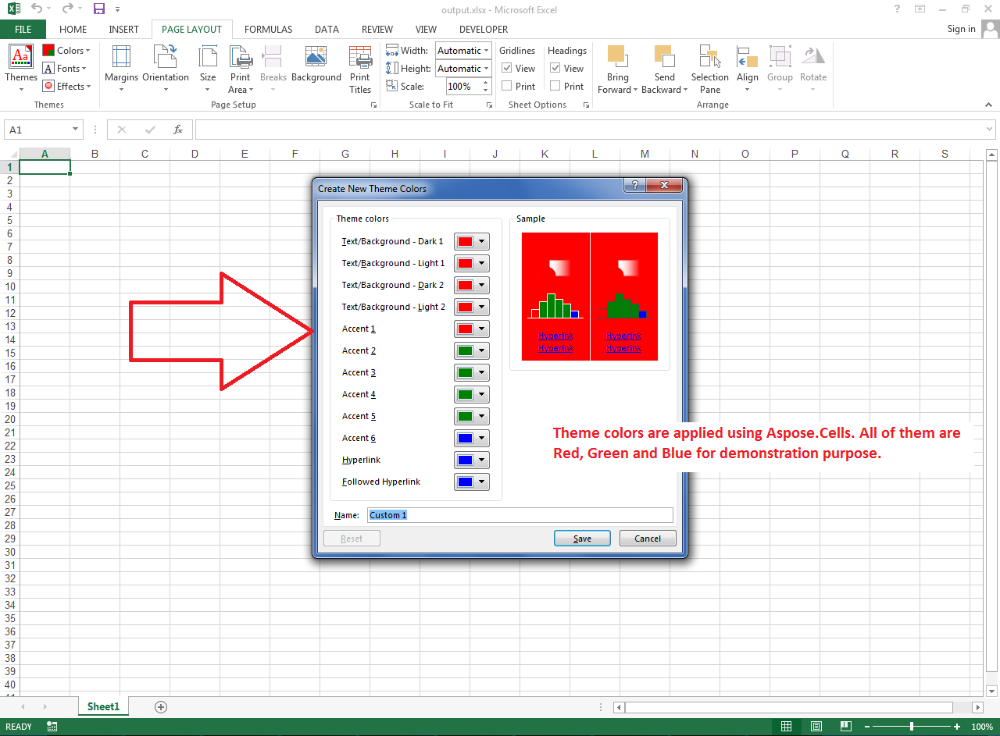

## **Apply Custom Theme Colors of the Workbook using Array of Colors**
The following sample code shows how to apply custom theme colors of the workbook using an array of colors. Please check the [output excel file](23167001.xlsx) generated with this code and the screenshot showing the effect of the code on the [output excel file](23167001.xlsx).

## **Sample Code**

