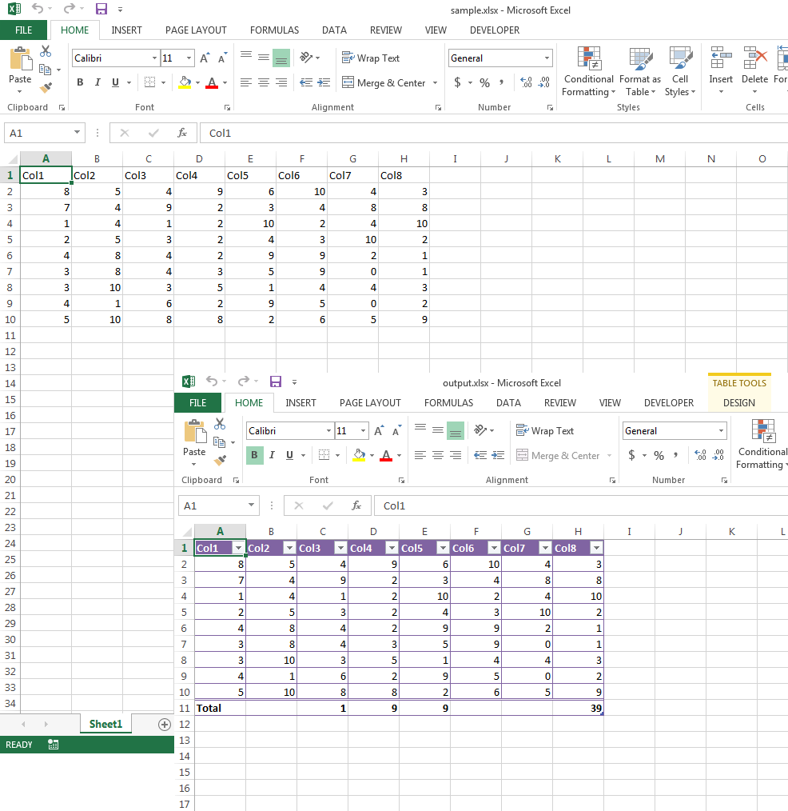

## **Possible Usage Scenarios**
Aspose.Cells allows you to create and manipulate new or existing list objects or tables. You can make use of various methods of the list object or table e.g. header row style, column stripes, style type, show subtotal, etc. and also work with individual columns of the table and set their name and totals calculation function which could be Min, Max, Count, Average, Sum etc.
## **Create and Manipulate Excel Table**
The following sample code loads the [sample excel file](23167015.xlsx) and then creates a list object or table in a range A1:H10, then it makes use of its various methods and sets show subtotal. Then it sets the total functions of 3rd, 4th and 5th columns to Min, Max and Count respectively and writes the [output excel file](23167016.xlsx). The following screenshot shows the effect of the sample code on the [sample excel file](23167015.xlsx) after execution.

## **Sample Code**

