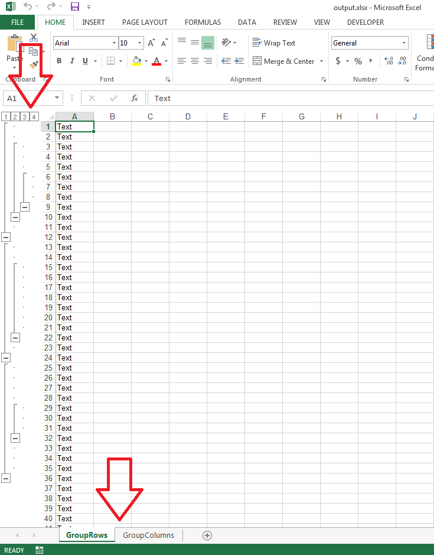

## **Possible Usage Scenarios**
Aspose.Cells allows you to group rows and columns in a worksheet using [ICells.GroupRows()](https://apireference.aspose.com/cells/cpp/class/aspose.cells.i_cell#a88e0180ed1a4a423e0bd3ac599ef9332) and [ICells.GroupColumns()](https://apireference.aspose.com/cells/cpp/class/aspose.cells.i_cell#aaa14179e2a84ba5c2857f8434570d3d8) methods.
## **Group Rows and Columns of Worksheet**
The following sample code shows how to group rows and columns. It groups the rows and columns up to the 3rd level. Please check the [output excel file](23166998.xlsx) generated with this code. It has two worksheets, the first one contains the grouping of rows and the second one contains the grouping of columns. Please also see the screenshot showing the grouping of rows in its first worksheet.

## **Sample Code**

