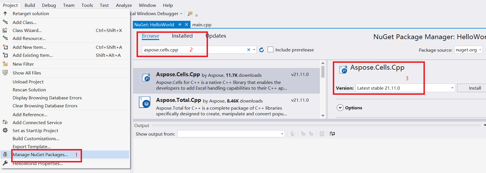

{} 

This page will show you how to install Aspose Cells, and create a Hello World application.

{}

## **How To Install**

### **Install Aspose Cells through NuGet.**

NuGet is the easiest way to download and install Aspose.Cells for C++. 
1. Create a Microsoft Visual Studio project for C++.
2. Include header file "Aspose.Cells.h".
3. Open Microsoft Visual Studio and NuGet package manager.
4. Search "aspose.cells.cpp" to find the desired Aspose.Cells for C++. 
5. Click on "Install", Aspose.Cells for C++ will be downloaded and referenced in your project.

****

You can also download it from the nuget web page for aspose.cells: 
[Aspose.Cells for C++ NuGet Package](https://www.nuget.org/packages/Aspose.Cells.Cpp/)

[More step for details](/cells/cpp/installation/)

### **A demo for using Aspose.Cells for C++ on Windows.**

1. Download Aspose.Cells for C++ from the following page:
[Download Aspose.Cells for C++(Windows)](https://downloads.aspose.com/cells/cpp/)
2. Unzip the package and you will find a Demo which is on how to use Aspose.Cells for C++.
	- Demo.sln: Run with Visual Studio 2017 or higher to test Aspose.Cells for C++, you can find the information in detail in the file main.cpp
	- main.cpp: A demo file shows how to code to test Aspose.Cells for C++
	- sourceFile/resultFile: test file storage directory used in main.cpp
3. Doc: APIs and license document
	- Aspose.Cells for C++.chm: APIs referance
	- The third party licenses of Aspose.Cells for C++.pdf      
4. Include: All header files related to Aspose.Cells for C++, but for users,
	- "Aspose.Cells.h" is the unique header file need to be included.
5. lib: All dlls and libs for 32bits(Win32) mode
6. lib64: All dlls and libs for 64bits(x64) mode

### **How to use Aspose.Cells for C++ on linux OS.**

1. Download Aspose.Cells for C++ from the following page:
[Download Aspose.Cells for C++(Linux)](https://downloads.aspose.com/cells/cpp/)
2. Unzip the package and you will find a Demo which is on how to use Aspose.Cells for C++ for Linux.
	- build:A directory created to run cmake and make 
	- sourceFile: source files for the demo
	- resultFile: result files for the demo
	- CMakeLists.txt: A file for creating the Makefile using cmake command
	- main.cpp: the test file for the demo
3. Include : All header files that needed, but usually you only need include Aspose.Cell.h in your project 
4. lib64: All libraries files needed to run your program
5. Doc: APIs and license document
	- Aspose.Cells for C++.chm: APIs referance
	- The third party licenses of Aspose.Cells for C++.pdf

## **Creating the Hello World Application**

The steps below creates the Hello World application using the Aspose.Cells API:

1. Create an instance of the [Workbook](https://apireference.aspose.com/cells/cpp/class/aspose.cells.i_workbook) class.
1. If you have a license, then [apply it](/cells/cpp/licensing/).
   If you are using the evaluation version, skip the license related code lines.
1. Access any desired cell of a worksheet in the Excel file.
1. Insert the words "**Hello World!**" into a cell accessed.
1. Generate the modified Microsoft Excel file.

The implementation of the above steps is demonstrated in the examples below.

### **Code Sample: Creating a New Workbook**

The following example creates a new workbook from the scratch, inserts "**Hello World!**" into cell A1 on the first worksheet and saves the Excel file.



### **Code Sample: Opening an Existing File**

The following example opens an existing Microsoft Excel template file, gets a cell and checks the value in the cell A1.


