## **System Requirements**
Aspose.Cells for Android via Java is platform‑independent and can be used on any platform where the Android Runtime environment is installed and will run on Android OS 2.0 or greater. At present, the component has been tested with:

- Android 5.1 v 22

## **Install Aspose.Cells for Android via Java from Maven Repository**
1. Add Maven repository to your `build.gradle`
2. Add **Aspose.Cells for Android via Java** JAR as a dependency


 // 1. Add Maven repository to your build.gradle 

repositories {
    mavenCentral()
    maven { url "http://repository.aspose.com/repo/" }
}

// 2. Add 'Aspose.Cells for Android via Java' JAR as a dependency

dependencies {
    ...
    ...
    compile (group: 'com.aspose', name: 'aspose-cells', version: '25.9', classifier: 'android.via.java')
}


## **How to use Aspose.Cells for Android via Java**
This topic will guide you through the necessary steps to set up Aspose.Cells for Android via Java in Android Studio IDE, assuming that you already have the latest version of Android Studio installed on your machine and you have also acquired the latest version of the Aspose.Cells for Android via Java package.

{} 
If you haven't installed Android Studio yet, you must first download and install it on your machine. You can download the latest version of Android Studio from [here](https://developer.android.com/studio/index.html#win-bundle), whereas details on how to install the IDE are available [here](https://developer.android.com/studio/install.html).
{} 

{} 
Aspose.Cells for Android via Java package can be downloaded from [here](https://downloads.aspose.com/cells/androidjava). Please note that each release package of Aspose.Cells for Android via Java mainly consists of two files as detailed below.

- **aspose-cells-x.x.x.jar** is the main library file containing all the classes from the Aspose.Cells for Android via Java API.  
- **aspose-cells-x.x.x-libs.apk** is the APK containing the 3rd‑party `bcprov-jdk15-146.jar` used for encryption and decryption facilities offered by the Aspose.Cells for Android via Java API.  

{} 

### **Getting Started with Aspose.Cells for Android via Java in Android Studio**
Once the Android Studio IDE loads, click on **File > New > New Project** as shown below.

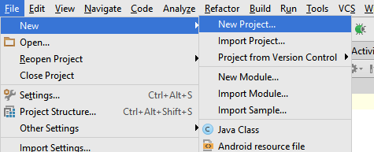

You can also create a new project from the Android Studio's Welcome Screen as shown below.

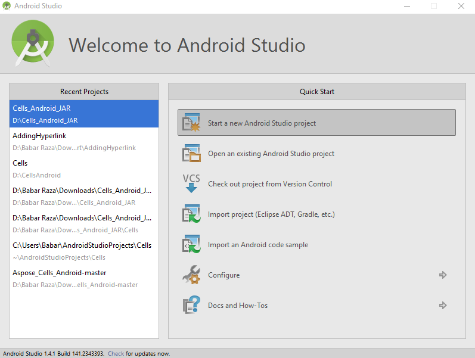

Next, you will be prompted to specify the application name, domain, and location to store the project files. You can choose to change the default values as per your choice or leave them as they are, and click **Next**.

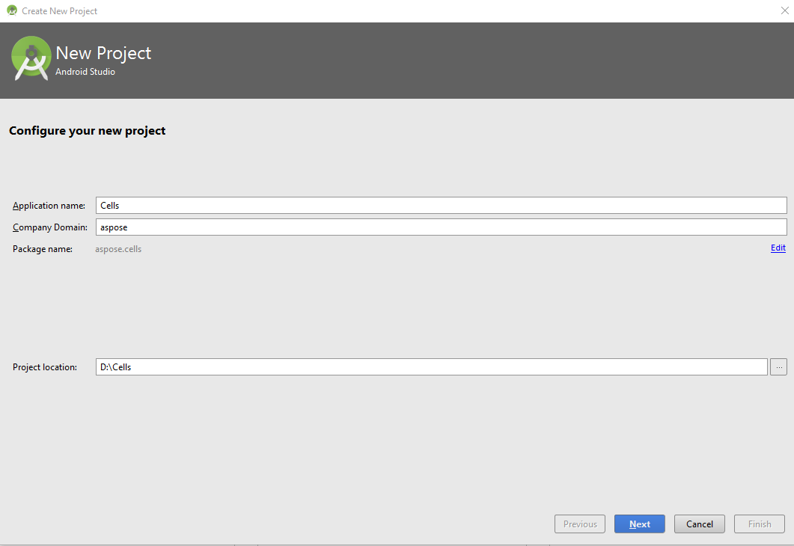

In the next step, you have to specify the Android device you wish to host/run your application on. Once selected, click the **Next** button.

Now you need to select the Activity from a predefined list of templates. To keep the demonstration simple, we have selected the **Empty Activity** template as shown below.

Click on the **Finish** button on the *Customize the Activity* dialog; we will keep all the default settings as they are.

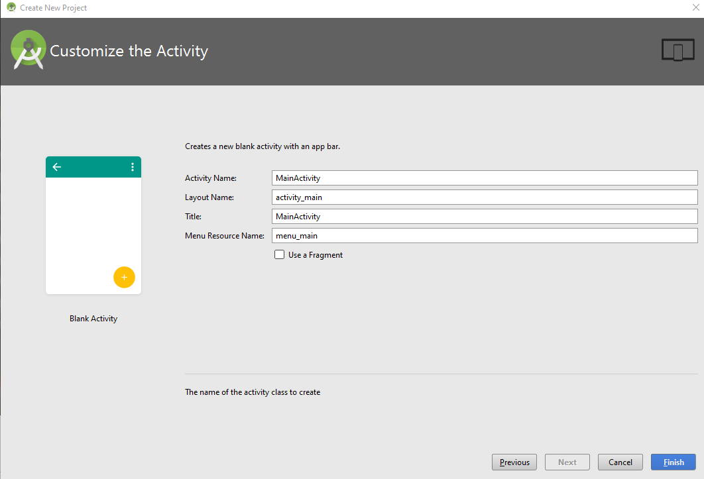

As soon as you click on the **Finish** button in the previous step, the IDE will start building the project as shown below. Let it finish or click the **Cancel** button.

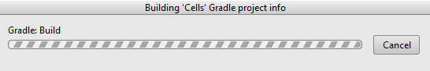

Now the project has been loaded in the IDE; however, you may wish to change the view to **Project** so that you can view the complete hierarchy of the project files. To change the view, please refer to the following snapshot.

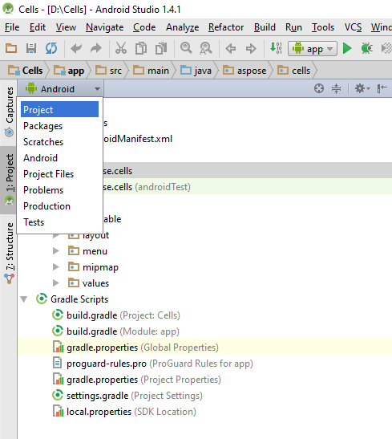

After changing the view to **Project**, find and open the **build.gradle** file in the editor and paste the following snippet as shown below.


dexOptions{
    javaMaxHeapSize "4g"
}


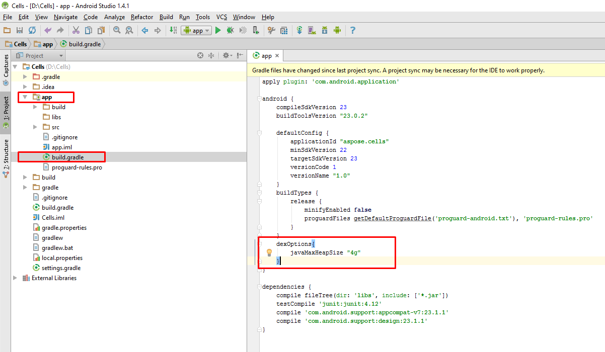

Next, we will add the Aspose.Cells for Android via Java JAR to the project. There are two important steps as detailed below.

- Manually copy the Aspose.Cells for Android via Java JAR to the **\app\libs** folder.  
- Add Aspose.Cells for Android via Java JAR as a library to the module as shown below.

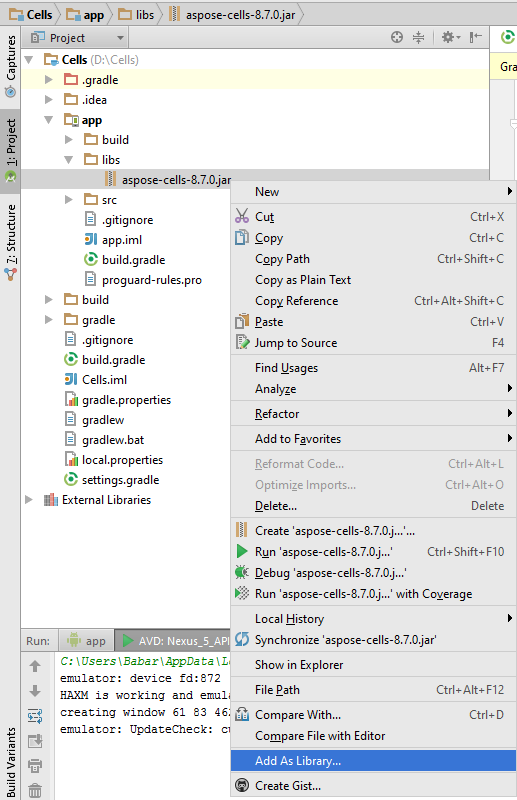

You will be prompted to select the module to which you wish to add the Aspose.Cells for Android via Java JAR as a library. Please choose appropriately and click **OK**.

You also need to add the APK file to the project. Copy the APK to the **\app\src\main\assets** folder. If you do not have the **assets** folder under **main**, you can create one by right‑clicking the **main** node in the Project view. Select **New > Folder > Assets Folder**.

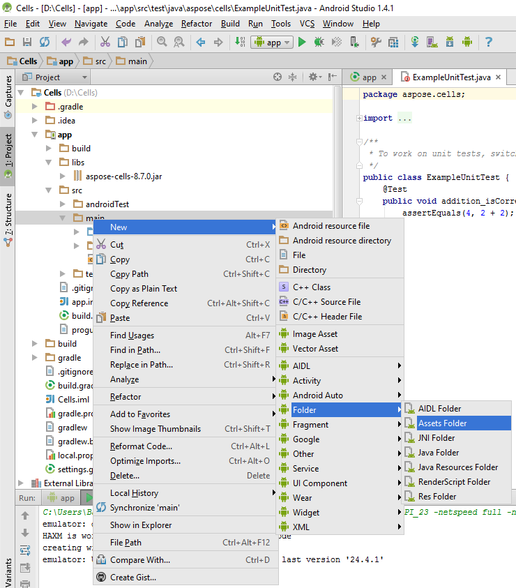

Once the APK has been added to the project, it needs to be loaded. There are two ways to load the APK as follows.

- Load the APK in a custom application class using the snippet provided below, and register the custom application class in the **AndroidManifest.xml**.


LibsLoadHelper.loadLibs(this);


- Load the APK in the **onCreate** method of **MainActivity**.


LibsLoadHelper.loadLibs(getApplicationContext());


Now we are ready to write the code. To keep the demonstration easy to understand, we have added a **Button** widget to the layout and will handle its click event as follows.


private class TestTask extends AsyncTask<Void, String, Boolean> {

    @Override
    protected Boolean doInBackground(Void... params) {
        Boolean result = false;

        Workbook book = new Workbook();
        Worksheet sheet = book.getWorksheets().get(0);
        Cells cells = sheet.getCells();
        Cell cell = cells.get("A1");
        cell.putValue("Hello World!");

        try {
            book.save(SD_PATH + "output.xlsx");
        } catch (Exception e) {
            e.printStackTrace();
        }

        return result;
    }
}


When you run the application using the play button on the IDE interface (or using **Shift + F10**), the emulator will load the application as shown below.

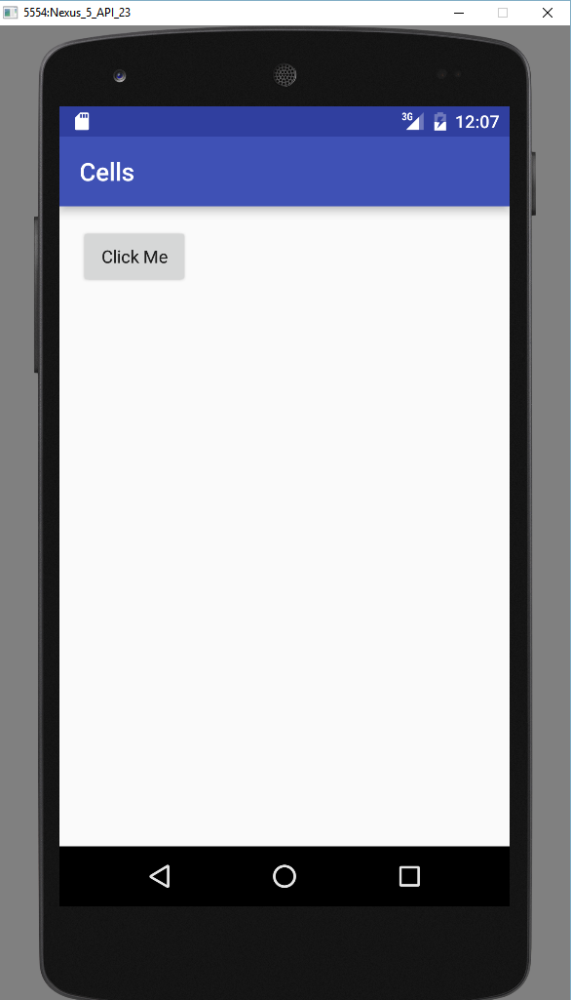

Clicking the button on the emulator will execute the code to create a new spreadsheet in the external storage folder of the emulator. You can access the file from the Android Device Monitor as shown below.

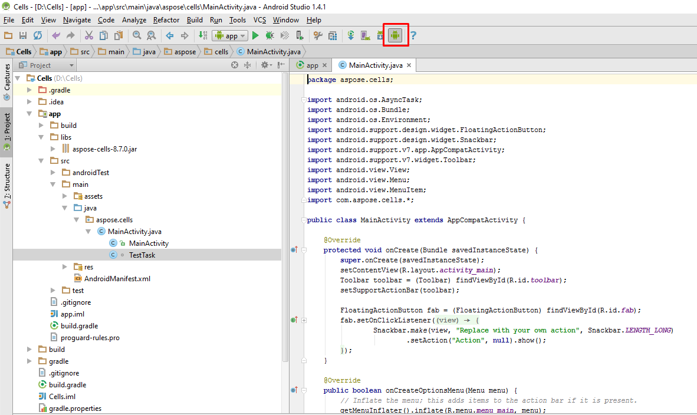

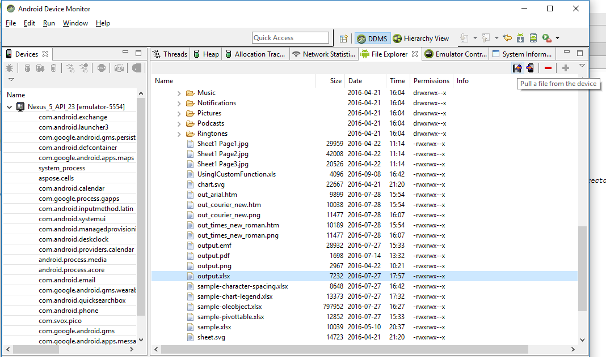
