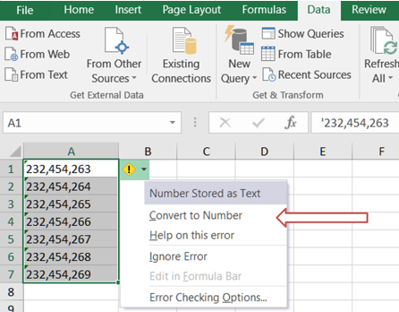
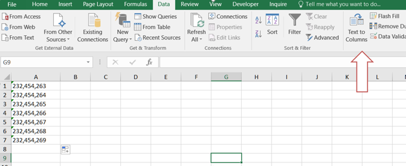
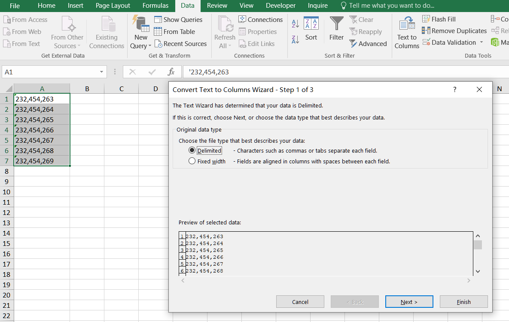
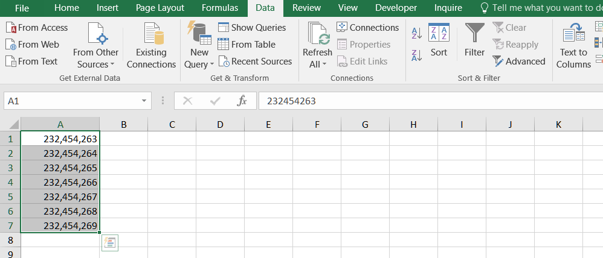
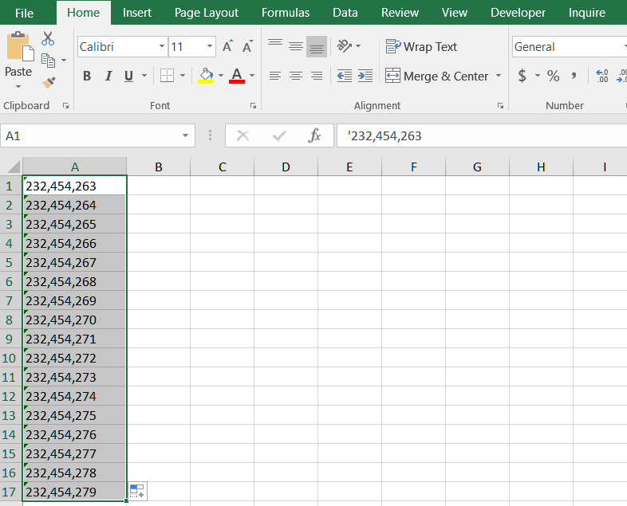
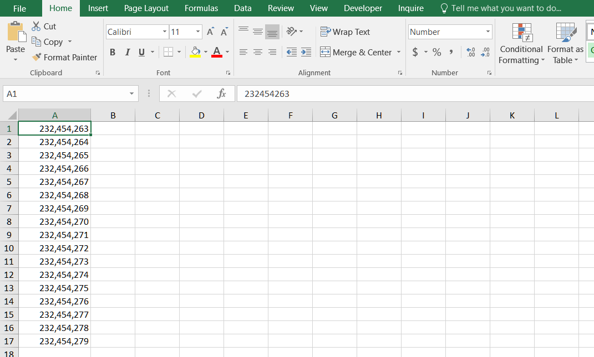

## **Possible Usage Scenarios**
Sometimes, you want to convert numeric data entered as text to numbers. You can enter numbers as text in Microsoft Excel by putting an apostrophe before a number, for example **'12345**. Excel then treats the number as a string. Aspose.Cells allows you to convert strings to numbers.

## How to Convert numbers stored as text to numbers in Excel
You can convert numbers stored as text to numbers by following a few simple steps.
1. Select any single cell or range of cells that has an error indicator in the upper-left corner.
1. Next to the selected cell or range of cells, click the error button that appears. On the menu, click Convert to Number. 
<br>

1. If the alert button is not available, Select a column with this problem. If you don't want to convert the whole column, you can select one or more cells instead. Just be sure the cells you select are in the same column, otherwise this process won't work. The Text to Columns button is typically used for splitting a column, but it can also be used to convert a single column of text to numbers. On the Data tab, click Text to Columns.
<br>

1. Click the Finish button in the pop-up box.
<br>

1. The numbers stored as text are transformed into numbers.
<br>


## How to Convert numbers stored as text to numbers using Aspose.Cells for C++
Aspose.Cells provides the [**Cells.ConvertStringToNumericValue()**](https://reference.aspose.com/cells/cpp/aspose.cells/cells/convertstringtonumericvalue/) method which can be used to convert all string or text numeric data into numbers.

The following screenshot shows string numbers in cells **A1:A17**. String numbers are aligned to the left.
<br>


These string numbers have been converted to numbers using [**Cells.ConvertStringToNumericValue()**](https://reference.aspose.com/cells/cpp/aspose.cells/cells/convertstringtonumericvalue/) in the following screenshot. As you can see, they are now right-aligned.
<br>


## C++ code to convert string numeric data to actual numbers

The following sample code illustrates how to convert all string numeric data to actual numbers in all worksheets.

```c++
#include <iostream>
#include "Aspose.Cells.h"
using namespace Aspose::Cells;

int main()
{
    Aspose::Cells::Startup();

    // For complete examples and data files, please go to https://github.com/aspose-cells/Aspose.Cells-for-C

    // Source directory path
    U16String srcDir(u"..\\Data\\01_SourceDirectory\\");

    // Output directory path
    U16String outDir(u"..\\Data\\02_OutputDirectory\\");

    // Instantiate workbook object with an Excel file
    U16String inputFilePath = srcDir + u"SampleBook.xlsx";
    Workbook workbook(inputFilePath);

    // Iterate through all worksheets and convert string values to numeric
    for (int32_t i = 0; i < workbook.GetWorksheets().GetCount(); i++)
    {
        workbook.GetWorksheets().Get(i).GetCells().ConvertStringToNumericValue();
    }

    // Save the Excel file
    U16String outputFilePath = outDir + u"output_out.xlsx";
    workbook.Save(outputFilePath);

    std::cout << "Conversion completed successfully!" << std::endl;

    Aspose::Cells::Cleanup();
}
```
