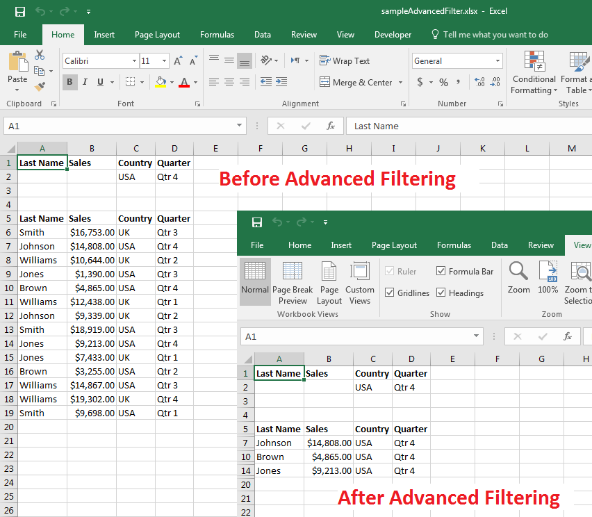

## **Possible Usage Scenarios**

Microsoft Excel allows you to apply *Advanced Filter* on worksheet data to display records that meet complex criteria. You can apply Advanced Filter with Microsoft Excel via its *Data > Advanced* command as shown in this screenshot.


Aspose.Cells also allows you to apply the Advanced Filter using the [**Worksheet::AdvancedFilter()**](https://reference.aspose.com/cells/cpp/aspose.cells/worksheet/advancedfilter/) method. Just like Microsoft Excel, it accepts the following parameters.

**isFilter**

Indicates whether filtering the list in place.

**listRange**

The list range.

**criteriaRange**

The criteria range.

**copyTo**

The range where copying data to.

**uniqueRecordOnly**

Only displaying or copying unique rows.

## **Apply Advanced Filter of Microsoft Excel to Display Records Meeting Complex Criteria**

The following sample code applies the advanced filter on the [Sample Excel File](48496692.xlsx) and generates the [Output Excel File](48496691.xlsx). The screenshot shows both files for comparison. As you can see inside the screenshot, data has been filtered inside the output Excel file according to complex criteria.



## **Sample Code**

```c++
#include <iostream>
#include "Aspose.Cells.h"
using namespace Aspose::Cells;

int main()
{
    Aspose::Cells::Startup();

    // For complete examples and data files, please go to https://github.com/aspose-cells/Aspose.Cells-for-C

    // Source directory path
    U16String sourceDir(u"..\\Data\\01_SourceDirectory\\");

    // Output directory path
    U16String outputDir(u"..\\Data\\02_OutputDirectory\\");

    // Load your source workbook
    Workbook workbook(sourceDir + u"sampleAdvancedFilter.xlsx");

    // Access first worksheet
    Worksheet ws = workbook.GetWorksheets().Get(0);

    // Apply advanced filter on range A5:D19 and criteria range is A1:D2
    // Besides, we want to filter in place
    // And, we want all filtered records not just unique records
    ws.Advanced_Filter(true, u"A5:D19", u"A1:D2", u"", false);

    // Save the workbook in xlsx format
    workbook.Save(outputDir + u"outputAdvancedFilter.xlsx", SaveFormat::Xlsx);

    std::cout << "Advanced filter applied successfully!" << std::endl;

    Aspose::Cells::Cleanup();
}
```
