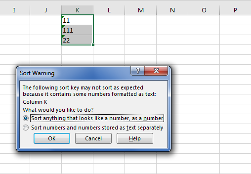

## **Possible Usage Scenarios**

Please consider this textual data i.e. {11, 111, 22}. This textual data is sorted because, in terms of text, 111 comes before 22. But, if you want to sort this data not as text but as numbers, then it will become {11, 22, 111} because numerically 111 comes after 22. Aspose.Cells provides [**DataSorter.GetSortAsNumber()**](https://reference.aspose.com/cells/cpp/aspose.cells/datasorter/getsortasnumber/) property to deal with this issue. Please set this property **true** and your textual data will be sorted as numerical data. The following screenshot shows the sort warning shown by Microsoft Excel when textual data which looks like numerical data is sorted.



## **Sample Code**

The following sample code illustrates the usage of [**DataSorter.GetSortAsNumber()**](https://reference.aspose.com/cells/cpp/aspose.cells/datasorter/getsortasnumber/) property as explained earlier. Please check its [sample Excel file](43352075.xlsx) and [output Excel file](43352076.xlsx) for more help.

```c++
#include <iostream>
#include "Aspose.Cells.h"

using namespace Aspose::Cells;

int main()
{
    Aspose::Cells::Startup();

    // Source directory path
    U16String srcDir(u"..\\Data\\01_SourceDirectory\\");

    // Output directory path
    U16String outDir(u"..\\Data\\02_OutputDirectory\\");

    // Create workbook
    Workbook workbook(srcDir + u"sampleSortAsNumber.xlsx");

    // Access first worksheet
    Worksheet worksheet = workbook.GetWorksheets().Get(0);

    // Create cell area
    CellArea ca = CellArea::CreateCellArea(u"A1", u"A20");

    // Create data sorter
    DataSorter sorter = workbook.GetDataSorter();

    // Find the index of column A
    int idx = CellsHelper::ColumnNameToIndex(u"A");

    // Add key in sorter for sorting in ascending order
    sorter.AddKey(idx, SortOrder::Ascending);
    sorter.SetSortAsNumber(true);

    // Perform sort
    sorter.Sort(worksheet.GetCells(), ca);

    // Save the output workbook
    workbook.Save(outDir + u"outputSortAsNumber.xlsx");

    std::cout << "Sorting completed successfully!" << std::endl;

    Aspose::Cells::Cleanup();
}
```

