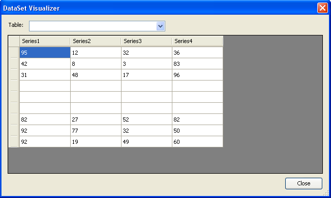

{}

You can export data from worksheets into data tables using Aspose.Cells. Sometimes you want to export the data of visible rows only. Aspose.Cells provides a way to achieve this. Use the [**ExportTableOptions.PlotVisibleRows**](https://reference.aspose.com/cells/cpp/aspose.cells/exporttableoptions/plotvisiblerows/) to specify that you want to export visible rows data only.

{}

This example shows how to export data from the following worksheet. Rows 5, 6 and 7 are hidden.

|**Sample data in worksheet, rows 5, 6 and 7 are hidden**|
| :- |
||

Once the data is exported to a data table using the [**Worksheet.Cells.ExportDataTable()**](https://reference.aspose.com/cells/cpp/aspose.cells/cells/exportdatatable/) method with the [**ExportTableOptions.PlotVisibleRows**](https://reference.aspose.com/cells/cpp/aspose.cells/exporttableoptions/plotvisiblerows/) option, it will look like this. Hidden rows are plotted as blank rows.

|**Hidden rows are exported to the data table as blank rows**|
| :- |
||

```cpp
#include <iostream>
#include "Aspose.Cells.h"
using namespace Aspose::Cells;

int main()
{
    Aspose::Cells::Startup();

    // Source directory path
    U16String srcDir(u"..\\Data\\01_SourceDirectory\\");

    // Path of input excel file
    U16String filePath = srcDir + u"aspose-sample.xlsx";

    // Load the source workbook
    Workbook workbook(filePath);

    // Access the first worksheet
    Worksheet worksheet = workbook.GetWorksheets().Get(0);

    // Specify export table options
    ExportTableOptions exportOptions;
    exportOptions.SetPlotVisibleRows(true);
    exportOptions.SetExportColumnName(true);

    // Export the data from worksheet with export options
    DataTable dataTable = worksheet.GetCells().ExportDataTable(0, 0, 10, 4, exportOptions);

    // Cleanup
    Aspose::Cells::Cleanup();

    return 0;
}
```