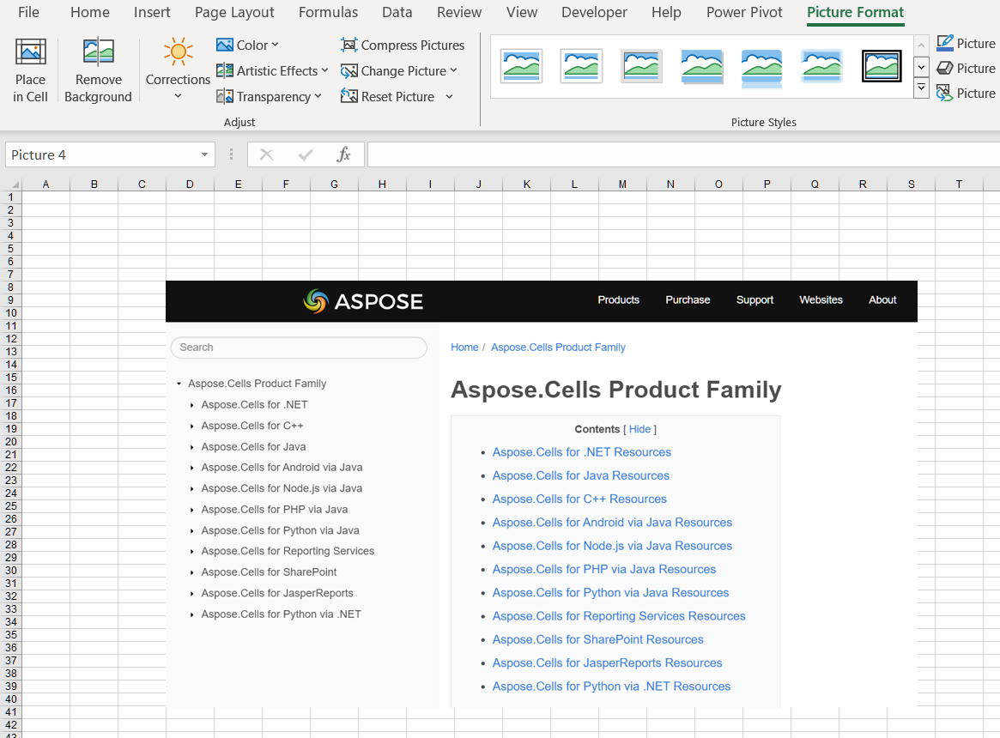

## **Possible Usage Scenarios**
The image adds a touch of brightness to your worksheet and provides a visual representation of the content. They also make it easier for you to understand the data and come up with insights. Although you have been able to use images in Excel for many years, Excel has only recently enabled the feature of images becoming actual cell values. Even if the layout of the drawing is modified, it will still be attached to the data. You can use it in tables, sort, filter, include in formulas, and so on!

## **How to Insert Picture in Cell Using Excel**
About how to insert a picture into a cell in Excel, follow these steps:

1. Go to the Insert tab and click on the Pictures option.
2. Select **Place in Cell**. Select one of the following sources from the Insert Picture From dropdown menu(**This Device**, **Stock Images** and **Online Pictures**). This Device for inserting picture from your device. Stock Images for inserting picture from stock images. Online Pictures for inserting picture from the web.
<br>

3. Select picture and insert picture to a cell.
<br>


## **How to Insert Picture over Cells Using Excel**
About how to insert a picture over cells in Excel, follow these steps:

1. Go to the Insert tab and click on the Pictures option.
2. Select **Place over Cells**. Select one of the following sources from the Insert Picture From dropdown menu(**This Device**, **Stock Images** and **Online Pictures**). This Device for inserting picture from your device. Stock Images for inserting picture from stock images. Online Pictures for inserting picture from the web.
<br>

3. Select picture and insert picture over cells.
<br>


## **How to Switch from Picture in Cell to Picture over Cells Using Excel**
You can easily switch from **Picture in Cell** to **Picture over Cells**. Please follow these steps:
1. Right click on cell and select **Picture in Cell** > **Place over Cells**. 
<br>

2. The result after switching is as follows:
<br>


## **How to Switch from Picture over Cells to Picture in Cell Using Excel**
You can easily switch from **Picture over Cells** to **Picture in Cell**. Please follow these steps:
1. Right click on picture and select **Place in Cell**. 
<br>

2. The result after switching is as follows:
<br>


## **How to Insert Picture in Cell Using C++**
Insert Picture in Cell using Aspose.Cells. Please see the following sample code. After executing the example code, a picture will be inserted into a cell.
1. Instantiate a Workbook object. 
2. Get the cell where you want to insert the picture.
3. Set Cell.EmbeddedImage property. 
4. Finally, it saves the workbook in [output XLSX](out.xlsx) format. 

## **Sample Code**

```c++
#include <iostream>
#include <fstream>
#include <vector>
#include "Aspose.Cells.h"

using namespace Aspose::Cells;

int main()
{
    Aspose::Cells::Startup();

    // Create a new workbook
    Workbook workbook;

    // Get the first worksheet
    Worksheet worksheet = workbook.GetWorksheets().Get(0);

    // Get cell D8
    Cell d8 = worksheet.GetCells().Get(u"D8");

    // Read image file into byte vector
    std::ifstream file("aspose.png", std::ios::binary);
    std::vector<uint8_t> imageData((std::istreambuf_iterator<char>(file)), std::istreambuf_iterator<char>());

    // Convert to Aspose's Vector and set embedded image in cell D8
    d8.SetEmbeddedImage(Vector<uint8_t>(imageData.data(), imageData.size()));

    // Save the workbook
    workbook.Save(u"out.xlsx");

    Aspose::Cells::Cleanup();
    return 0;
}
```

