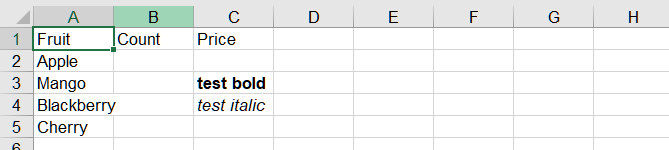

## **Possible Usage Scenarios**
When you need to set styled data for a specific Cell, you can assign an HTML string to the Cell. Of course, you can also obtain the HTML string of the cell. Aspose.Cells offers this feature. Aspose.Cells provides the following properties and methods to help you achieve your goals.
- [**Cell::GetHtmlString**](https://reference.aspose.com/cells/cpp/aspose.cells/cell/gethtmlstring/)
- [**Cell::SetHtmlString**](https://reference.aspose.com/cells/cpp/aspose.cells/cell/sethtmlstring/)

## **Get and set html string using Aspose.Cells**
This example shows how to:

1. Create a workbook and add some data.
1. Get the specific Cell in the first worksheet.
1. Set html string to the Cell.
1. Get html string of the Cell.

```cpp
#include <iostream>
#include "Aspose.Cells.h"

using namespace Aspose::Cells;

int main()
{
    Aspose::Cells::Startup();

    // Instantiate a Workbook object
    Workbook workbook;

    // Obtain the reference of the newly added worksheet
    Worksheet ws = workbook.GetWorksheets().Get(0);
    Cells cells = ws.GetCells();

    // Setting the value to the cells
    Cell cell = cells.Get(u"A1");
    cell.PutValue(u"Fruit");

    cell = cells.Get(u"B1");
    cell.PutValue(u"Count");

    cell = cells.Get(u"C1");
    cell.PutValue(u"Price");

    cell = cells.Get(u"A2");
    cell.PutValue(u"Apple");

    cell = cells.Get(u"A3");
    cell.PutValue(u"Mango");

    cell = cells.Get(u"A4");
    cell.PutValue(u"Blackberry");

    cell = cells.Get(u"A5");
    cell.PutValue(u"Cherry");

    Cell c3 = cells.Get(u"C3");
    // Set HTML string for C3 cell
    c3.SetHtmlString(u"<b>test bold</b>");

    Cell c4 = cells.Get(u"C4");
    // Set HTML string for C4 cell
    c4.SetHtmlString(u"<i>test italic</i>");

    // Get the HTML string of specific cell
    std::cout << c3.GetHtmlString().ToUtf8() << std::endl;
    std::cout << c4.GetHtmlString().ToUtf8() << std::endl;

    Aspose::Cells::Cleanup();
    return 0;
}
```

## Output generated by the sample code

The following screenshot shows the output of the above sample code.


