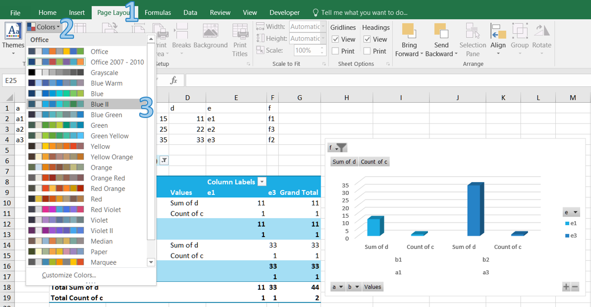

## **How to Apply and Create Color Scheme in Excel**
Document themes make it easy to coordinate colors, fonts, and graphic formatting effects of Excel documents and update them quickly. 
Themes provide a unified look with named styles, graphical effects and other objects used in a workbook. For example, the Accent1 style, for example, looks different in the Office and the Apex themes. Often, you apply a document theme and then amend it to how you want it.

### **How to Apply a Color Scheme in Excel**
1. Open Excel and go to the "Page Layout" tab in the Excel ribbon.
1. Click on the "Colors" button in the "Themes" section.
<br>

1. Choose a color palette that matches your requirements or hover over a scheme to see a live preview.

### **How to Create a Custom Color Scheme in Excel**
You can create your own color set to give your document a fresh, unique look or comply with your organization’s brand standards.

1. Open Excel and go to the "Page Layout" tab in the Excel ribbon.
1. Click on the "Colors" button in the "Themes" section.
1. Click "Customize Colors..." button.
<br>


1. In the "Create New Theme Colors" dialog box, you can select colors for each element by clicking on the color dropdowns next to them. You can choose colors from the palette or define custom colors using the "More Colors" option.
<br>

1. After selecting all the desired colors, provide a name for your custom color scheme in the "Name" field.

1. Click on the "Save" button to save your custom color scheme. Your custom color scheme will now be available in the "Colors" drop-down menu for future use.

## **How to Create and Apply Color Scheme in Aspose.Cells**
Aspose.Cells provides features for customizing themes and colors.

### **How to Create Custom Color Theme in Aspose.Cells**
If theme colors are used in the file, we don't need to modify each cell individually, we just need to modify the colors in the theme.

The following example shows how to apply custom themes with your desired colors. We use a sample template file manually created in Microsoft Excel 2007.

The following example loads a template XLSX file, defines colors for different theme color types, applies the custom colors and saves the excel file.

```cpp
#include <iostream>
#include "Aspose.Cells.h"
using namespace Aspose::Cells;

int main()
{
    Aspose::Cells::Startup();

    // For complete examples and data files, please go to https://github.com/aspose-cells/Aspose.Cells-for-C

    // Source directory path
    U16String srcDir(u"..\\Data\\01_SourceDirectory\\");

    // Output directory path
    U16String outDir(u"..\\Data\\02_OutputDirectory\\");

    // Define Color array (of 12 colors) for Theme
    Vector<Aspose::Cells::Color> carr(12);
    carr[0] = Color::AntiqueWhite(); // Background1
    carr[1] = Color::Brown();       // Text1
    carr[2] = Color::AliceBlue();   // Background2
    carr[3] = Color::Yellow();      // Text2
    carr[4] = Color::YellowGreen(); // Accent1
    carr[5] = Color::Red();         // Accent2
    carr[6] = Color::Pink();        // Accent3
    carr[7] = Color::Purple();      // Accent4
    carr[8] = Color::PaleGreen();   // Accent5
    carr[9] = Color::Orange();      // Accent6
    carr[10] = Color::Green();      // Hyperlink
    carr[11] = Color::Gray();       // Followed Hyperlink

    // Path of input excel file
    U16String inputFilePath = srcDir + u"book1.xlsx";

    // Instantiate a Workbook and open the template file
    Workbook workbook(inputFilePath);

    // Set the custom theme with specified colors
    workbook.CustomTheme(u"CustomeTheme1", carr);

    // Path of output excel file
    U16String outputFilePath = outDir + u"output.out.xlsx";

    // Save as the excel file
    workbook.Save(outputFilePath);

    std::cout << "Custom theme applied and file saved successfully!" << std::endl;

    Aspose::Cells::Cleanup();
}
```

### **How to Apply Theme Colors in Aspose.Cells**

The following example applies a cell’s foreground and font colors based on the default theme (of the workbook) color types. It also saves the excel file to disk.

```cpp
#include <iostream>
#include "Aspose.Cells.h"

using namespace Aspose::Cells;

int main()
{
    Aspose::Cells::Startup();

    // Source directory path
    U16String srcDir(u"..\\Data\\01_SourceDirectory\\");

    // Output directory path
    U16String outDir(u"..\\Data\\02_OutputDirectory\\");

    // Create workbook
    Workbook workbook;

    // Get cells collection in the first (default) worksheet
    Cells cells = workbook.GetWorksheets().Get(0).GetCells();

    // Get the D3 cell
    Cell c = cells.Get(u"D3");

    // Get the style of the cell
    Style s = c.GetStyle();

    // Set foreground color for the cell from the default theme Accent2 color
    s.SetForegroundThemeColor(ThemeColor(ThemeColorType::Accent2, 0.5));

    // Set the pattern type
    s.SetPattern(BackgroundType::Solid);

    // Get the font for the style
    Font f = s.GetFont();

    // Set the theme color
    f.SetThemeColor(ThemeColor(ThemeColorType::Accent4, 0.1));

    // Apply style
    c.SetStyle(s);

    // Put a value
    c.PutValue(u"Testing1");

    // Save the excel file
    workbook.Save(outDir + u"output.out.xlsx");

    std::cout << "Excel file saved successfully!" << std::endl;

    Aspose::Cells::Cleanup();
}
```

### **How to Get and Set Theme Colors in Aspose.Cells**
 Below are a few methods and properties that implement theme colors.

- [**Style.GetForegroundThemeColor()**](https://reference.aspose.com/cells/cpp/aspose.cells/style/getforegroundthemecolor/): Used to set the foreground color.
- [**Style.GetBackgroundThemeColor()**](https://reference.aspose.com/cells/cpp/aspose.cells/style/getbackgroundthemecolor/): Used to set the background color.
- [**Font.GetThemeColor()**](https://reference.aspose.com/cells/cpp/aspose.cells/font/getthemecolor/): Used to set the font color.
- [**Workbook.GetThemeColor**](https://reference.aspose.com/cells/cpp/aspose.cells/workbook/getthemecolor/): Used to get a theme color.
- [**Workbook.SetThemeColor**](https://reference.aspose.com/cells/cpp/aspose.cells/workbook/setthemecolor/): Used to set a theme color.

The following example shows how to get and set theme colors.

The following example uses a template XLSX file, gets the colors for different theme color types, changes the colors and saves the Microsoft Excel file.

```cpp
#include <iostream>
#include "Aspose.Cells.h"

using namespace Aspose::Cells;

int main()
{
    Aspose::Cells::Startup();

    // Source directory path
    U16String srcDir(u"..\\Data\\01_SourceDirectory\\");

    // Output directory path
    U16String outDir(u"..\\Data\\02_OutputDirectory\\");

    // Path of input excel file
    U16String inputFilePath = srcDir + u"book1.xlsx";

    // Path of output excel file
    U16String outputFilePath = outDir + u"output.out.xlsx";

    // Create workbook
    Workbook workbook(inputFilePath);

    // Get the Background1 theme color
    Color c = workbook.GetThemeColor(ThemeColorType::Background1);

    // Print the color
    std::cout << "theme color Background1: " << c.r << ", " << c.g << ", " << c.b << std::endl;

    // Get the Accent2 theme color
    c = workbook.GetThemeColor(ThemeColorType::Accent2);

    // Print the color
    std::cout << "theme color Accent2: " << c.r << ", " << c.g << ", " << c.b << std::endl;

    // Change the Background1 theme color
    workbook.SetThemeColor(ThemeColorType::Background1, Color::Red());

    // Get the updated Background1 theme color
    c = workbook.GetThemeColor(ThemeColorType::Background1);

    // Print the updated color for confirmation
    std::cout << "theme color Background1 changed to: " << c.r << ", " << c.g << ", " << c.b << std::endl;

    // Change the Accent2 theme color
    workbook.SetThemeColor(ThemeColorType::Accent2, Color::Blue());

    // Get the updated Accent2 theme color
    c = workbook.GetThemeColor(ThemeColorType::Accent2);

    // Print the updated color for confirmation
    std::cout << "theme color Accent2 changed to: " << c.r << ", " << c.g << ", " << c.b << std::endl;

    // Save the updated file
    workbook.Save(outputFilePath);

    std::cout << "Theme colors updated and file saved successfully!" << std::endl;

    Aspose::Cells::Cleanup();
}
```

## **Advance topics**
- [Extract Theme Data from Excel File](/cells/cpp/extract-theme-data-from-excel-file/)
