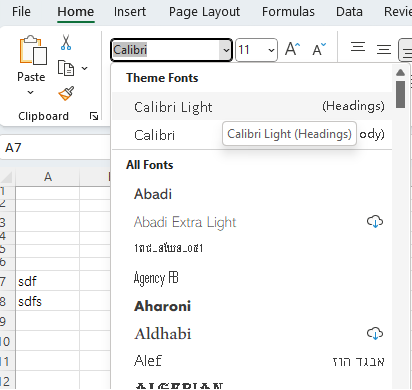

{}

The default font will automatically change when the region setting is changed.

If the default font is changed, the row height and column width is also changed, and it may even mess up the page layout.

What caused the default font to change?

If Excel theme font is set, Excel will automatically switch between different fonts based on the current language environment.

{}

## **Headings And Body Theme Font In Excel**

In Excel, select the Home tab, click on the font dropdown box, you will see "Theme Fonts" with two theme fonts: Calibri Light (Headings) and Calibri (Body) on the top with English region setting.

****

If Theme Font is selected, the font name will display differently in different regions.
If you do not want the font to be automatically changed in different regions, don't select the two Theme Fonts.

## **Changing Headings And Body Font Programmatically**
With Aspose.Cells for C++, we can check whether the default font is a theme font or set the theme font with the [**Font.GetSchemeType()**](https://reference.aspose.com/cells/cpp/aspose.cells/font/getschemetype/) property.

The following sample code shows how to manipulate theme font.

```cpp
#include <iostream>
#include "Aspose.Cells.h"

using namespace Aspose::Cells;

int main()
{
    Aspose::Cells::Startup();

    // Create a workbook object
    Workbook workbook(u"Book1.xlsx");

    // Get the default style
    Style defaultStyle = workbook.GetDefaultStyle();

    // Get the font scheme type
    FontSchemeType schemeType = defaultStyle.GetFont().GetSchemeType();

    // Check if the font is a theme font
    if (schemeType == FontSchemeType::Major || schemeType == FontSchemeType::Minor)
    {
        std::cout << "It's theme font" << std::endl;
    }

    // Change theme font to normal font
    defaultStyle.GetFont().SetSchemeType(FontSchemeType::None);

    // Set the modified default style back to the workbook
    workbook.SetDefaultStyle(defaultStyle);

    Aspose::Cells::Cleanup();
    return 0;
}
```

## **Dynamically Gets Local Theme Font Programmatically**
Sometimes, our servers and users' machines are not in the same region. How can we obtain the same font that users want for file processing?

We have to set the system regional settings before loading the file with the [**LoadOptions.GetRegion()**](https://reference.aspose.com/cells/cpp/aspose.cells/loadoptions/getregion/) property.

The following sample code shows how to get the local theme font.

```cpp
#include <iostream>
#include "Aspose.Cells.h"

using namespace Aspose::Cells;

int main()
{
    Aspose::Cells::Startup();

    // Instantiate a new LoadOptions
    LoadOptions options;

    // Set the customer's region to Japan
    options.SetRegion(CountryCode::Japan);

    // Instantiate a new Workbook with the specified options
    Workbook workbook(u"Book1.xlsx", options);

    // Get the default style of the workbook
    Style defaultStyle = workbook.GetDefaultStyle();

    // Get the customer's local font name
    U16String localFontName = defaultStyle.GetFont().GetName();

    std::cout << "Local Font Name: " << localFontName.ToUtf8() << std::endl;

    Aspose::Cells::Cleanup();
    return 0;
}
```

