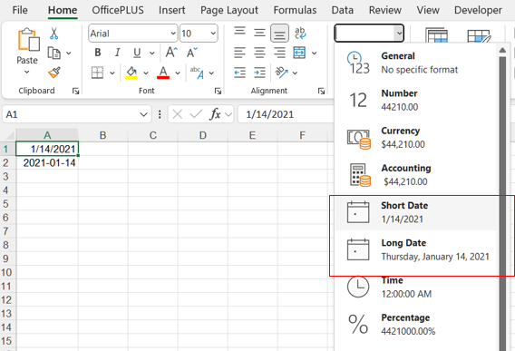
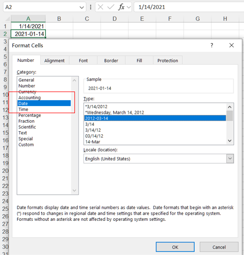

## **Possible Usage Scenarios**
Formatting numbers as dates in Excel (or any spreadsheet software) is important for several reasons, especially when you are working with data that includes time or scheduling information. Here's why formatting numbers to dates is beneficial:

1. **Proper Interpretation of Date Values**: In Excel, dates are stored as serial numbers (e.g., 1 represents January 1, 1900, and 44210 represents September 6, 2021). If these numbers aren’t formatted as dates, users might see meaningless numbers instead of recognizable dates. Formatting them properly allows Excel to display them as actual dates (e.g., 09/06/2021 instead of 44210).
2. **Simplifies Time-Related Calculations**: Excel can perform many calculations using dates, such as calculating the number of days between two dates, adding or subtracting days, or determining the day of the week. If the numbers are not formatted as dates, Excel won’t be able to perform these operations effectively. For example, if you want to know the number of days between 09/01/2023 and 10/01/2023, Excel can easily calculate this if the numbers are in date format.
3. **Ensures Consistency**: When all date-related values are formatted correctly, it ensures that all dates appear in a uniform, readable style. This consistency is important in business reports, project schedules, and databases where date consistency is crucial. Different regions use different date formats (e.g., MM/DD/YYYY in the US vs. DD/MM/YYYY in many other countries), so formatting helps ensure that dates are interpreted correctly.
4. **Improves Readability**: Dates presented in a standard format (e.g., 01/01/2024) are easier to read than raw serial numbers like 45000. Proper date formatting makes your spreadsheet more user-friendly and prevents confusion. This is especially important in scenarios such as scheduling, timelines, event planning, or historical data.
5. **Helps in Sorting and Filtering**: When dates are formatted correctly, Excel recognizes them as actual dates, making it easier to sort or filter data chronologically. For example, you can sort a list of events by date or filter a data range to show only records between two specific dates. Without proper date formatting, sorting might occur based on the raw number instead of actual calendar dates.
6. **Enables Use of Date Functions**: Excel provides a range of powerful date functions, such as: TODAY(), DATEDIF(), WORKDAY(), YEAR(), MONTH(), DAY(). These functions require dates to be formatted properly for accurate calculations.
7. **Supports Visualization (Charts/Timelines)**: Dates formatted correctly can be used to create charts and graphs where time is a key axis. For instance, in a timeline chart, Excel needs dates in a recognized format to plot events accurately over time. Misformatted or unformatted numbers may result in charts that don’t make sense or reflect incorrect information.
8. **Prevents Misinterpretation**: Raw numbers can easily be misinterpreted. For instance, 44210 could be read as a general numeric value, but when formatted as a date, it is clear that it represents September 6, 2021. Properly formatted dates help avoid misinterpretation of the data.
9. **Facilitates Data Entry**: When cells are formatted as dates, users are prompted to enter data in a valid date format, which prevents data entry errors and ensures that date values are captured correctly.
10. **Critical for Scheduling and Tracking**: In any situation that involves scheduling, tracking, or deadlines (like project management, financial forecasting, or time-sensitive reports), formatting numbers as dates is crucial for accuracy and understanding. It allows for better planning and execution.

## **How to Format Number to Date in Excel**
To format a number as a date in Excel, follow these steps:

### **Using the Ribbon (Home Tab)**
1. Select the cells containing the numbers you want to format as dates.
2. Go to the Home tab in the ribbon.
3. In the Number group, click the dropdown arrow in the Number Format box (which may show "General" or "Number" by default).
4. Choose Short Date or Long Date from the dropdown. Short Date: Displays the date in a concise format, e.g., MM/DD/YYYY (US format) or DD/MM/YYYY (international format). Long Date: Displays the date in a more descriptive format, e.g., Monday, January 1, 2024.
<br>


### **Using the Format Cells Dialog Box**
1. Select the cells you want to format.
2. Right-click on the selected cells and choose Format Cells, or press Ctrl + 1 (Windows) or Cmd + 1 (Mac).
3. In the Format Cells dialog box, go to the Number tab.
4. From the list on the left, select Date.
5. Choose the desired date format from the list on the right (e.g., MM/DD/YYYY, DD/MM/YYYY, or custom formats).
<br>

6. Click OK to apply the date format.

## **How to Format Number to Date in Aspose.Cells**

To format numbers as date in Aspose.Cells for C++ library for working with Excel files, you can apply date formatting to cells programmatically. Here's how you can do it using C++ with Aspose.Cells:

```cpp
#include <iostream>
#include "Aspose.Cells.h"
using namespace Aspose::Cells;

int main()
{
    Aspose::Cells::Startup();

    // Create a new workbook
    Workbook workbook;

    // Access the first worksheet
    Worksheet worksheet = workbook.GetWorksheets().Get(0);

    // Access the cell where you want to apply the date format
    Cell a1 = worksheet.GetCells().Get(u"A1");

    // Set a numeric value that represents a date (e.g., 44210 represents 09/06/2021 in Excel)
    a1.PutValue(44210);

    // Create a style object to apply the date format
    Style a1Style = a1.GetStyle();

    // "14" represents a standard date format in Excel (MM/DD/YYYY)
    a1Style.SetNumber(14);

    // Apply the style to the cell
    a1.SetStyle(a1Style);

    // Access the cell where you want to apply the currency format
    Cell a2 = worksheet.GetCells().Get(u"A2");

    // Set a numeric value to the cell
    a2.PutValue(44210);

    // Create a style object to apply the date format
    Style a2Style = a2.GetStyle();

    // Custom format for YYYY-MM-DD
    a2Style.SetCustom(u"YYYY-MM-DD");

    // Apply the style to the cell
    a2.SetStyle(a2Style);

    // Save the workbook
    workbook.Save(u"DateFormatted.xlsx");

    Aspose::Cells::Cleanup();
}
```
