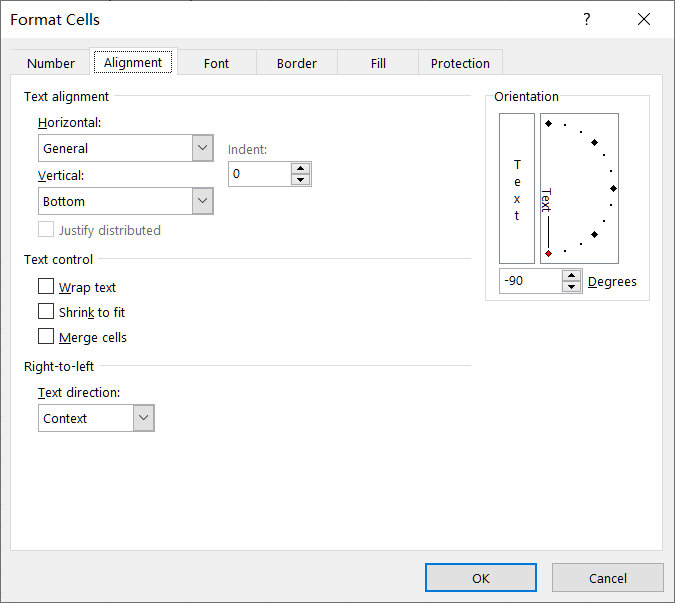
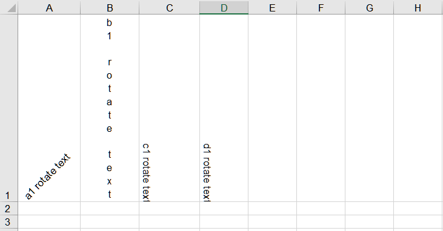

## **Rotate Text of Cell in Aspose.Cells**

Aspose.Cells is a powerful C++ component that enables developers to work with Excel spreadsheets programmatically. One of the features provided by Aspose.Cells is the ability to rotate cells, allowing you to customize the orientation of text and improve the visual presentation of your data. In this document, we will explore how to rotate cells using Aspose.Cells.

## **How to Rotate Text of Cell in Excel**
To rotate a cell in Excel, you can use the following steps:
1. Open Excel and select the cell or range of cells that you want to rotate.
1. Right-click on the selected cell(s) and choose "Format Cells" from the context menu. Alternatively, you can go to the "Home" tab in the Excel ribbon, click on the "Format" dropdown in the "Cells" group, and select "Format Cells."
1. In the "Format Cells" dialog box, navigate to the "Alignment" tab.
1. Under the "Orientation" section, you will see the options to rotate the text. You can directly input the desired rotation angle in degrees in the "Degrees" box. Positive values rotate the text counterclockwise, and negative values rotate it clockwise.
<br>

1. Once you have selected the desired rotation, click "OK" to apply the changes. The selected cell(s) will now be rotated based on your chosen rotation angle or orientation.

## **How to Rotate Text of Cell using Aspose.Cells API**

[**Style.GetRotationAngle()**](https://reference.aspose.com/cells/cpp/aspose.cells/style/getrotationangle/) property makes it convenient to rotate cells. To rotate cells in Aspose.Cells, you need to follow these steps:
1. Load the Excel Workbook
<br>
First, you need to load the Excel workbook using Aspose.Cells. You can use the Workbook class to open an existing Excel file or create a new one. 

1. Access the Worksheet
<br>
Once the workbook is loaded, you need to access the worksheet where you want to rotate the cells. You can either access the worksheet by its index or name. 

1. Rotate the text of Cell
<br>
Now that you have access to the worksheet, you can rotate the cells by modifying the Style object of the desired cells. The Style object allows you to set various formatting options, including rotation. 

1. Save the Workbook
<br>
After rotating the cells, you can save the modified workbook back to a file or stream using the Save method.

## **C++ Sample Code**

Please see the following code, it creates a workbook object and set different rotation angles for several cells. The screenshot shows the result after the execution of the sample code.
<br>


```cpp
#include <iostream>
#include "Aspose.Cells.h"
using namespace Aspose::Cells;

int main()
{
    Aspose::Cells::Startup();

    // Create a new workbook
    Workbook workbook;

    // Get the first worksheet
    Worksheet worksheet = workbook.GetWorksheets().Get(0);

    // Row index of the cell
    int row = 0;
    // Column index of the cell
    int column = 0;

    // Get cell A1 and set its value
    Cell a1 = worksheet.GetCells().Get(row, column);
    a1.PutValue(u"a1 rotate text");
    Style a1Style = a1.GetStyle();

    // Set the rotation angle in degrees
    a1Style.SetRotationAngle(45);
    a1.SetStyle(a1Style);

    // Set column index to 1 for cell B1
    column = 1;
    Cell b1 = worksheet.GetCells().Get(row, column);
    b1.PutValue(u"b1 rotate text");
    Style b1Style = b1.GetStyle();

    // Set the rotation angle in degrees
    b1Style.SetRotationAngle(255);
    b1.SetStyle(b1Style);

    // Set column index to 2 for cell C1
    column = 2;
    Cell c1 = worksheet.GetCells().Get(row, column);
    c1.PutValue(u"c1 rotate text");
    Style c1Style = c1.GetStyle();

    // Set the rotation angle in degrees
    c1Style.SetRotationAngle(-90);
    c1.SetStyle(c1Style);

    // Set column index to 3 for cell D1
    column = 3;
    Cell d1 = worksheet.GetCells().Get(row, column);
    d1.PutValue(u"d1 rotate text");
    Style d1Style = d1.GetStyle();

    // Set the rotation angle in degrees
    d1Style.SetRotationAngle(-90);
    d1.SetStyle(d1Style);

    // Save the workbook
    workbook.Save(u"out.xlsx");

    Aspose::Cells::Cleanup();
    return 0;
}
```

