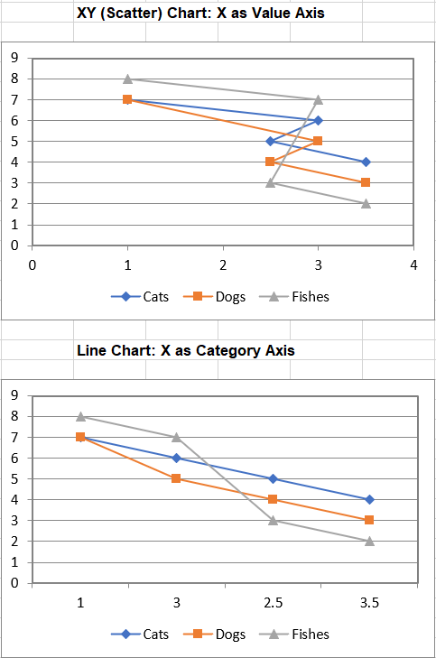

## **Possible Usage Scenarios**
There are different types of X axes. While the Y axis is a Value type axis, the X axis can be a Category type axis or a Value type axis. Using a Value axis, the data is treated as continuously varying numerical data, and the marker is placed at a point along the axis which varies according to its numerical value. Using a Category axis, the data is treated as a sequence of non-numerical text labels, and the marker is placed at a point along the axis according to its position in the sequence. The sample below illustrates the difference between Value and Category Axes.
Our sample data is shown in the [sample Table file](sample.png) below. The first column contains our X axis data, which can be treated as Categories or as Values. Note that the numbers are not equally spaced, nor do they even appear in numerical order.


## **Handle X and Category axis like Microsoft Excel**
We will display this data on two types of chart, the first chart is XY (Scatter) chart X as Value Axis, the second chart is line chart X as Category Axis.



## **Sample Code**
```cpp
#include <iostream>
#include "Aspose.Cells.h"
using namespace Aspose::Cells;

int main() {
    Aspose::Cells::Startup();

    // Create an instance of Workbook
    Workbook workbook;

    // Access the first worksheet
    Worksheet worksheet = workbook.GetWorksheets().Get(0);

    // Put the sample values used in charts
    worksheet.GetCells().Get(u"A2").PutValue(1);
    worksheet.GetCells().Get(u"A3").PutValue(3);
    worksheet.GetCells().Get(u"A4").PutValue(2.5);
    worksheet.GetCells().Get(u"A5").PutValue(3.5);
    worksheet.GetCells().Get(u"B1").PutValue(u"Cats");
    worksheet.GetCells().Get(u"C1").PutValue(u"Dogs");
    worksheet.GetCells().Get(u"D1").PutValue(u"Fishes");
    worksheet.GetCells().Get(u"B2").PutValue(7);
    worksheet.GetCells().Get(u"B3").PutValue(6);
    worksheet.GetCells().Get(u"B4").PutValue(5);
    worksheet.GetCells().Get(u"B5").PutValue(4);
    worksheet.GetCells().Get(u"C2").PutValue(7);
    worksheet.GetCells().Get(u"C3").PutValue(5);
    worksheet.GetCells().Get(u"C4").PutValue(4);
    worksheet.GetCells().Get(u"C5").PutValue(3);
    worksheet.GetCells().Get(u"D2").PutValue(8);
    worksheet.GetCells().Get(u"D3").PutValue(7);
    worksheet.GetCells().Get(u"D4").PutValue(3);
    worksheet.GetCells().Get(u"D5").PutValue(2);

    // Create Line Chart: X as Category Axis
    int pieIdx = worksheet.GetCharts().Add(ChartType::LineWithDataMarkers, 6, 15, 20, 21);

    // Retrieve the Chart object
    Chart chart = worksheet.GetCharts().Get(pieIdx);

    // Add Series
    chart.GetNSeries().Add(u"B2:D5", true);

    // Set the category data
    chart.GetNSeries().SetCategoryData(u"=Sheet1!$A$2:$A$5");

    // Set the first series name
    chart.GetNSeries().Get(0).SetName(u"Cats");

    // Set the second series name
    chart.GetNSeries().Get(1).SetName(u"Dogs");

    // Set the third series name
    chart.GetNSeries().Get(2).SetName(u"Fishes");

    // Set the Legend at the bottom of the chart area
    chart.GetLegend().SetPosition(LegendPositionType::Bottom);

    // Fill the PlotArea area with nothing
    chart.GetPlotArea().GetArea().GetFillFormat().SetFillType(FillType::None);

    // Create XY (Scatter) Chart: X as Value Axis
    pieIdx = worksheet.GetCharts().Add(ChartType::ScatterConnectedByLinesWithDataMarker, 6, 6, 20, 12);

    // Retrieve the Chart object
    chart = worksheet.GetCharts().Get(pieIdx);

    // Add Series
    chart.GetNSeries().Add(u"B2:D5", true);

    // Set X values for series
    chart.GetNSeries().Get(0).SetXValues(u"{1,3,2.5,3.5}");
    chart.GetNSeries().Get(1).SetXValues(u"{1,3,2.5,3.5}");
    chart.GetNSeries().Get(2).SetXValues(u"{1,3,2.5,3.5}");

    // Set the first series name
    chart.GetNSeries().Get(0).SetName(u"Cats");

    // Set the second series name
    chart.GetNSeries().Get(1).SetName(u"Dogs");

    // Set the third series name
    chart.GetNSeries().Get(2).SetName(u"Fishes");

    // Set the Legend at the bottom of the chart area
    chart.GetLegend().SetPosition(LegendPositionType::Bottom);

    // Fill the PlotArea area with nothing
    chart.GetPlotArea().GetArea().GetFillFormat().SetFillType(FillType::None);

    // Save the Excel file
    workbook.Save(u"XAxis.xlsx");

    Aspose::Cells::Cleanup();
    return 0;
}
```

