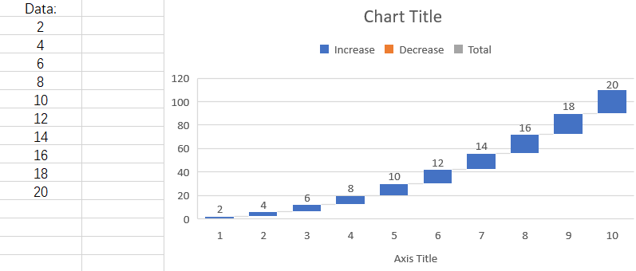

## **Possible Usage Scenarios**

Aspose.Cells APIs have exposed the [**ChartGlobalizationSettings**](https://reference.aspose.com/cells/cpp/aspose.cells.charts/chartglobalizationsettings/) class in order to deal with the scenarios where the user wishes to set chart component to different language. custom labels for Subtotals in a spreadsheet. 

## **Introduction to ChartGlobalizationSettings Class**

The [**ChartGlobalizationSettings**](https://reference.aspose.com/cells/cpp/aspose.cells.charts/chartglobalizationsettings/) class currently offers the following 8 methods which can be overridden in a custom class to translate such as AxisTitle name, AxisUnit name, ChartTitle name and so on to different language.

1. [**GetAxisTitleName**](https://reference.aspose.com/cells/cpp/aspose.cells.charts/chartglobalizationsettings/getaxistitlename/): Gets the name of Title for Axis.
1. [**GetAxisUnitName**](https://reference.aspose.com/cells/cpp/aspose.cells.charts/chartglobalizationsettings/getaxisunitname/): Gets the Name of Axis Unit.
1. [**GetChartTitleName**](https://reference.aspose.com/cells/cpp/aspose.cells.charts/chartglobalizationsettings/getcharttitlename/): Gets the name of Chart Title.
1. [**GetLegendDecreaseName**](https://reference.aspose.com/cells/cpp/aspose.cells.charts/chartglobalizationsettings/getlegenddecreasename/): Gets the name of Decrease for Legend.
1. [**GetLegendIncreaseName**](https://reference.aspose.com/cells/cpp/aspose.cells.charts/chartglobalizationsettings/getlegendincreasename/): Gets the name of increase for Legend.
1. [**GetLegendTotalName**](https://reference.aspose.com/cells/cpp/aspose.cells.charts/chartglobalizationsettings/getlegendtotalname/): Gets the name of Total for Legend.
1. [**GetOtherName**](https://reference.aspose.com/cells/cpp/aspose.cells.charts/chartglobalizationsettings/getothername/): Gets the name of "Other" labels for Chart.
1. [**GetSeriesName**](https://reference.aspose.com/cells/cpp/aspose.cells.charts/chartglobalizationsettings/getseriesname/): Gets the name of Series in the Chart.

### **Custom language translation**
Here, we will create a waterfall chart based on the following data. The names of chart components will be displayed in English in the chart. We will use a Turkish language example to show how to display the Chart Title, Legend Increase/Decrease names, Total name, and Axis Title in Turkish.



## **Sample Code**
The following sample code loads the [sample Excel file](waterfall.xlsx).

```cpp
#include <iostream>
#include "Aspose.Cells.h"
using namespace Aspose::Cells;
using namespace Aspose::Cells::Charts;

class TurkeyChartGlobalizationSettings : public ChartGlobalizationSettings
{
public:
    TurkeyChartGlobalizationSettings() : ChartGlobalizationSettings() {}

    U16String GetChartTitleName() override
    {
        return u"Grafik Başlığı"; // Chart Title
    }

    U16String GetLegendIncreaseName() override
    {
        return u"Artış"; // Increase
    }

    U16String GetLegendDecreaseName() override
    {
        return u"Düşüş"; // Decrease
    }

    U16String GetLegendTotalName() override
    {
        return u"Toplam"; // Total
    }

    U16String GetAxisTitleName() override
    {
        return u"Eksen Başlığı"; // Axis Title
    }
};

void ChartGlobalizationSettingsTest()
{
    // Create an instance of existing Workbook
    U16String pathName = u"input.xlsx";
    Workbook workbook(pathName);

    // Set custom chartGlobalizationSettings, here is TurkeyChartGlobalizationSettings
    TurkeyChartGlobalizationSettings* globalizationSettings = new TurkeyChartGlobalizationSettings();
    workbook.GetSettings().GetGlobalizationSettings()->SetChartSettings(globalizationSettings);

    // Get the worksheet
    Worksheet worksheet = workbook.GetWorksheets().Get(0);

    // Load the chart from source worksheet
    ChartCollection chartCollection = worksheet.GetCharts();
    Chart chart = chartCollection.Get(0);

    // Chart Calculate
    chart.Calculate();

    // Get the chart title
    Title title = chart.GetTitle();

    // Output the name of the Chart title
    std::cout << "\nWorkbook chart title: " << title.GetText().ToUtf8() << std::endl;

    // Get the legend labels
    Vector<U16String> legendEntriesLabels = chart.GetLegend().GetLegendLabels();

    // Output the name of the Legend
    for (int i = 0; i < legendEntriesLabels.GetLength(); i++)
    {
        std::cout << "\nWorkbook chart legend: " << legendEntriesLabels[i].ToUtf8() << std::endl;
    }

    // Output the name of the Axis title
    Title categoryAxisTitle = chart.GetCategoryAxis().GetTitle();
    std::cout << "\nWorkbook category axis title: " << categoryAxisTitle.GetText().ToUtf8() << std::endl;

    delete globalizationSettings;
}

int main()
{
    Aspose::Cells::Startup();
    ChartGlobalizationSettingsTest();
    Aspose::Cells::Cleanup();
    return 0;
}
```

## Output generated by the sample code

This is the console output of the above sample code.



Workbook chart title: Grafik Başlığı

Workbook chart legend: Artış

Workbook chart legend: Düşüş

Workbook chart legend: Toplam

Workbook category axis tile: Eksen Başlığı

