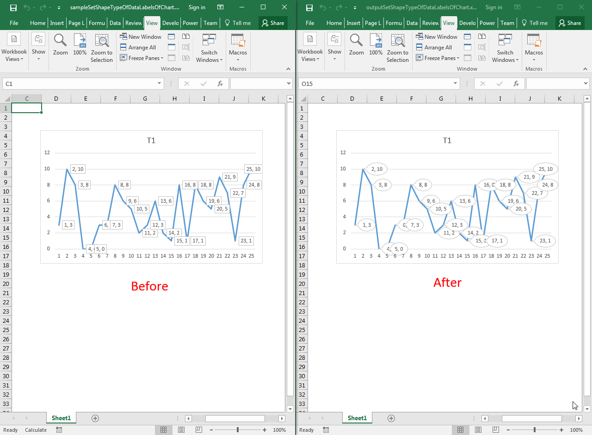

## **Possible Usage Scenarios**
You can change the shape type of data labels of the chart using the `DataLabels.ShapeType` property. It takes the value of `DataLabelShapeType` enumeration and changes the shape type of data labels accordingly. Some of its values are:



 DataLabelShapeType.BentLineCallout

DataLabelShapeType.DownArrowCallout

DataLabelShapeType.Ellipse

DataLabelShapeType.LineCallout

DataLabelShapeType.Rect

etc.



## **Set the Shape Type of Data Labels of Chart**
The following sample code changes the shape type of data labels of the chart to `DataLabelShapeType.WedgeEllipseCallout`. Please see the [sample Excel file](60489778.xlsx) used in this code and the [output Excel file](60489779.xlsx) generated by it. The screenshot shows the effect of the code on the sample Excel file. 



## **Sample Code**
```cpp
#include <iostream>
#include "Aspose.Cells.h"

using namespace Aspose::Cells;
using namespace Aspose::Cells::Charts;

int main()
{
    Aspose::Cells::Startup();

    // Load source Excel file
    U16String inputFilePath = u"sampleSetShapeTypeOfDataLabelsOfChart.xlsx";
    Workbook wb(inputFilePath);

    // Access first worksheet
    Worksheet ws = wb.GetWorksheets().Get(0);

    // Access first chart
    Chart ch = ws.GetCharts().Get(0);

    // Access first series
    Series srs = ch.GetNSeries().Get(0);

    // Set the shape type of data labels i.e. Speech Bubble Oval
    srs.GetDataLabels().SetShapeType(DataLabelShapeType::WedgeEllipseCallout);

    // Save the output Excel file
    U16String outputFilePath = u"outputSetShapeTypeOfDataLabelsOfChart.xlsx";
    wb.Save(outputFilePath);

    std::cout << "Shape type of data labels set successfully!" << std::endl;

    Aspose::Cells::Cleanup();
}
```