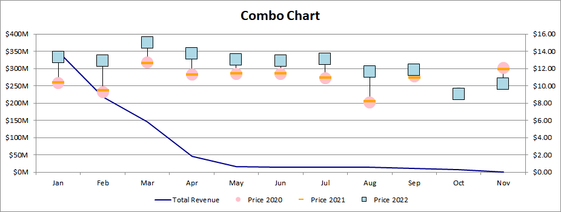

---  
title: How to create Combo chart with C++  
linktitle: How to create Combo chart  
description: Learn how to create a combo chart using Aspose.Cells for C++. Our comprehensive guide will demonstrate how to combine different chart types into one combo chart for a more effective data presentation.  
keywords: Aspose.Cells for C++, Combo Chart, Combining Chart Types, Data Presentation, Effective Visualization.  
type: docs  
weight: 73  
url: /cpp/create-combo-chart/  
ai_search_scope: cells_cpp
ai_search_endpoint: "https://docsearch.api.aspose.cloud/ask"
---  

## **Possible Usage Scenarios**  
Combo charts in Excel allow you to combine two or more chart types easily, making your data more understandable. Combo charts are helpful when your data contains multiple kinds of values, including price and volume. Moreover, combo charts are useful when your data values vary widely from series to series.  

  
## **Combo chart**  
After running the code below, you will see the Combo chart as shown below.  

  
## **Sample Code**  
The following sample code loads the [sample Excel file](combo.xlsx) and generates the [output Excel file](out.xlsx).  

```c++
#include <iostream>
#include "Aspose.Cells.h"
using namespace Aspose::Cells;

int main()
{
    Aspose::Cells::Startup();

    // Create the workbook
    Workbook workbook(u"combo.xlsx");

    // Access the first worksheet
    Worksheet worksheet = workbook.GetWorksheets().Get(0);

    // Add a stock volume (VHLC) chart
    int32_t pieIdx = worksheet.GetCharts().Add(ChartType::StockVolumeHighLowClose, 15, 0, 34, 12);
    
    // Retrieve the Chart object
    Chart chart = worksheet.GetCharts().Get(pieIdx);
    
    // Set the legend to be shown
    chart.SetShowLegend(true);
    
    // Set the chart title
    chart.GetTitle().SetText(u"Combo Chart");
    
    // Set the legend position to the bottom of the chart area
    chart.GetLegend().SetPosition(LegendPositionType::Bottom);
    
    // Set data range
    chart.SetChartDataRange(u"A1:E12", true);
    
    // Set category data
    chart.GetNSeries().GetCategoryData() = u"A2:A12";
    
    // Set the Series[1], Series[2], and Series[3] to different Marker Styles
    for (int32_t j = 0; j < chart.GetNSeries().GetCount(); j++)
    {
        switch (j)
        {
            case 1:
                chart.GetNSeries().Get(j).GetMarker().SetMarkerStyle(ChartMarkerType::Circle);
                chart.GetNSeries().Get(j).GetMarker().SetMarkerSize(15);
                chart.GetNSeries().Get(j).GetMarker().GetArea().SetFormatting(FormattingType::Custom);
                chart.GetNSeries().Get(j).GetMarker().GetArea().SetForegroundColor(Color::Pink());
                chart.GetNSeries().Get(j).GetBorder().SetIsVisible(false);
                break;
            case 2:
                chart.GetNSeries().Get(j).GetMarker().SetMarkerStyle(ChartMarkerType::Dash);
                chart.GetNSeries().Get(j).GetMarker().SetMarkerSize(15);
                chart.GetNSeries().Get(j).GetMarker().GetArea().SetFormatting(FormattingType::Custom);
                chart.GetNSeries().Get(j).GetMarker().GetArea().SetForegroundColor(Color::Orange());
                chart.GetNSeries().Get(j).GetBorder().SetIsVisible(false);
                break;
            case 3:
                chart.GetNSeries().Get(j).GetMarker().SetMarkerStyle(ChartMarkerType::Square);
                chart.GetNSeries().Get(j).GetMarker().SetMarkerSize(15);
                chart.GetNSeries().Get(j).GetMarker().GetArea().SetFormatting(FormattingType::Custom);
                chart.GetNSeries().Get(j).GetMarker().GetArea().SetForegroundColor(Color::LightBlue());
                chart.GetNSeries().Get(j).GetBorder().SetIsVisible(false);
                break;
        }
    }

    // Set the chart type for Series[0]
    chart.GetNSeries().Get(0).SetType(ChartType::Line);
    
    // Set style for the border of the first series
    chart.GetNSeries().Get(0).GetBorder().SetStyle(LineType::Solid);
    
    // Set color for the first series
    chart.GetNSeries().Get(0).GetBorder().SetColor(Color::DarkBlue());
    
    // Fill the PlotArea with nothing
    chart.GetPlotArea().GetArea().SetFormatting(FormattingType::None);
    
    // Save the Excel file
    workbook.Save(u"out.xlsx");

    Aspose::Cells::Cleanup();
}
```  

