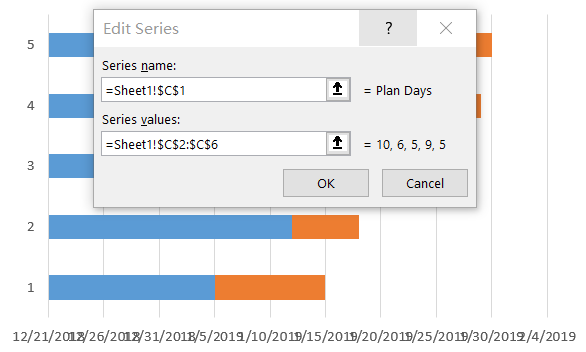
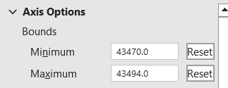

## **What is Gantt chart**

A Gantt chart is a type of bar chart that illustrates a project schedule. It shows the start and finish dates of the various elements of a project. Each task or activity is represented by a bar, with its length corresponding to its duration. Gantt charts also indicate dependencies between tasks, allowing project managers to visualize the sequence in which tasks need to be completed. They are widely used in project management to plan, schedule, and track projects effectively.

## **How to Create a Gantt Chart in Excel**

You can create a Gantt chart in Excel by following these steps:
1. Add some data for Gantt chart. 
<br>

1. Select the data and go to Insert --> Charts --> Insert Column or Bar Chart --> Stacked Bar Chart. In our example, that’s B1:B7, and then Insert **Stacked Bar** chart.
<br>


1. Select the chart, **Select Data**->**Add**, set the **Series name** and **Series values** as following.
<br>


1. Select the chart, edit the **Horizontal(Category) Axis Labels**.
<br>


1. **Format Axis** the Y Axis, select **Categories in reverse order**.
1. Select the **Blue Series** and set the **Fill->NO Fill**.
1. **Format Axis** the X Axis, set the **Minimum and Maximum**(1/5/2019:43470,1/30/2019:43494).
<br>


1. **Add Data labels** for the chart, now you will get a Gantt chart.
<br>


## **How to Add a Gantt Chart in Aspose.Cells**
Please see the following sample code. It loads the [sample Excel file](sample.xlsx) that contains some sample data. It then creates the stacked bar chart based on the initial data and sets relevant properties. Finally, it saves the workbook to [output XLSX format](result.xlsx). The following screenshot shows the Gantt chart created by Aspose.Cells in the output Excel file.
<br>


### **Sample Code**

```c++
#include <iostream>
#include "Aspose.Cells.h"

using namespace Aspose::Cells;

int main()
{
    Aspose::Cells::Startup();

    // Create an instance of Workbook
    Workbook workbook(u"sample.xlsx");

    // Access the first worksheet
    Worksheet worksheet = workbook.GetWorksheets().Get(0);

    // Create BarStacked Chart
    int32_t chartIndex = worksheet.GetCharts().Add(ChartType::BarStacked, 5, 6, 20, 15);
    
    // Retrieve the Chart object
    Chart chart = worksheet.GetCharts().Get(chartIndex);
    
    // Set the chart title name
    chart.GetTitle().SetText(u"Gantt Chart");
    
    // Set the chart title visibility
    chart.GetTitle().SetIsVisible(true);
    
    // Set data range
    chart.SetChartDataRange(u"B1:B6", true);
    
    // Add series data range
    chart.GetNSeries().Add(u"C2:C6", true);
    
    // No fill for one series
    chart.GetNSeries().Get(0).GetArea().GetFillFormat().SetFillType(FillType::None);
    
    // Set the Horizontal(Category) Axis
    chart.GetNSeries().SetCategoryData(u"A2:A6");
    
    // Reverse the Horizontal(Category) Axis
    chart.GetCategoryAxis().SetIsPlotOrderReversed(true);
    
    // Set the value axis's MinValue and MaxValue
    chart.GetValueAxis().SetMinValue(worksheet.GetCells().Get(u"B2").GetValue());
    chart.GetValueAxis().SetMaxValue(worksheet.GetCells().Get(u"D6").GetValue());
    
    // Set the PlotArea with no fill
    chart.GetPlotArea().GetArea().GetFillFormat().SetFillType(FillType::None);
    
    // Show the DataLabels
    chart.GetNSeries().Get(1).GetDataLabels().SetShowValue(true);
    
    // Disable the Legend
    chart.SetShowLegend(false);
    
    // Save the result
    workbook.Save(u"result.xlsx");

    Aspose::Cells::Cleanup();
}
```

