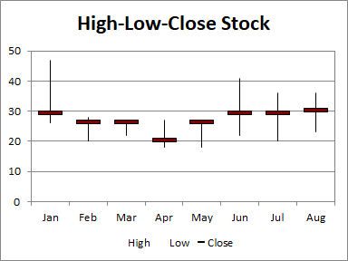

--- 
title: Create High-Low-Close(HLC) Stock Chart with C++ 
linktitle: Create High-Low-Close(HLC) Stock Chart 
description: Learn how to create a high-low-close stock chart using Aspose.Cells for C++. Our step-by-step guide will demonstrate how to plot stock market data, including the high, low, and close prices, onto a chart for better analysis and visualization. 
keywords: Aspose.Cells for C++, High-Low-Close Stock Chart, Stock Market Data, Analysis, Visualization. 
type: docs 
weight: 181 
url: /cpp/create-high-low-close-stock-chart/ 
--- 

## **Possible Usage Scenarios** 
The High-Low-Close (HLC) stock chart uses four columns of data. The first column is a category, usually a date but stock names can also be used. The next three columns in order are for high, low, and closing prices. The range of price for each category is indicated by a vertical line from low to high, and closing price is shown using a tickmark extending to the right of this line. 

 
## **Visibility improvements in the chart** 
Sometimes, to make the chart look more intuitive, we can modify the appearance of the marker (close), or make it display on the secondary axis. 

 
## **Sample Code** 
The following sample code loads the [sample Excel file](High-Low-Close.xlsx) and generates the [output Excel file](out.xlsx).

```c++
#include <iostream>
#include "Aspose.Cells.h"
using namespace Aspose::Cells;

int main()
{
    Aspose::Cells::Startup();

    // Create an instance of Workbook
    Workbook workbook(u"High-Low-Close.xlsx");

    // Access the first worksheet
    Worksheet worksheet = workbook.GetWorksheets().Get(0);

    // Create High-Low-Close-Stock Chart
    int pieIdx = worksheet.GetCharts().Add(ChartType::StockHighLowClose, 5, 6, 20, 12);

    // Retrieve the Chart object
    Chart chart = worksheet.GetCharts().Get(pieIdx);

    // Set the legend can be showed
    chart.SetShowLegend(true);

    // Set the chart title name 
    chart.GetTitle().SetText(u"High-Low-Close Stock");

    // Set the Legend at the bottom of the chart area
    chart.GetLegend().SetPosition(LegendPositionType::Bottom);

    // Set data range
    chart.SetChartDataRange(u"A1:D9", true);

    // Set category data 
    chart.GetNSeries().GetCategoryData() = u"A2:A9";

    // Set the marker with the built-in data 
    chart.GetNSeries().Get(2).GetMarker().SetMarkerStyle(ChartMarkerType::Dash);
    chart.GetNSeries().Get(2).GetMarker().SetMarkerSize(20);
    chart.GetNSeries().Get(2).GetMarker().GetArea().SetFormatting(FormattingType::Custom);
    chart.GetNSeries().Get(2).GetMarker().GetArea().SetForegroundColor(Color::Maroon());

    // Fill the PlotArea area with nothing 
    chart.GetPlotArea().GetArea().GetFillFormat().SetFillType(FillType::None);

    // Save the Excel file
    workbook.Save(u"out.xlsx");

    std::cout << "Chart created and Excel file saved successfully!" << std::endl;

    Aspose::Cells::Cleanup();
}
``` 
