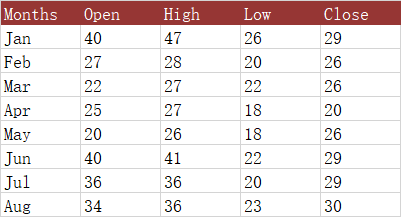
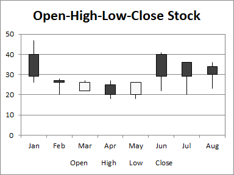

## **Possible Usage Scenarios**
The Open-High-Low-Close (OHLC) chart uses five columns of data, in order: category, open, high, low, and close. The range of prices in each category is again indicated by a vertical line, while the range between open and close is given by a wider floating bar; if the price increases in the category (close is higher than open), the bar is filled with one color, while if the price decreases, the bar is filled with another. This type of chart is often called a candlestick chart.





## **Visibility improvements in the chart**
We often use colors rather than black and white to indicate increasing and decreasing prices. In the first set of candlesticks below, red shows increasing and green decreasing prices.


## **Sample Code**
The following sample code loads the [sample Excel file](Open-High-Low-Close.xlsx) and generates the [output Excel file](out.xlsx).

```c++
#include <iostream>
#include "Aspose.Cells.h"
using namespace Aspose::Cells;

int main()
{
    Aspose::Cells::Startup();

    // Create an instance of Workbook
    Workbook workbook(u"Open-High-Low-Close.xlsx");
    // Access the first worksheet
    Worksheet worksheet = workbook.GetWorksheets().Get(0);
    // Create High-Low-Close-Stock Chart
    int32_t pieIdx = worksheet.GetCharts().Add(ChartType::StockOpenHighLowClose, 5, 6, 20, 12);
    // Retrieve the Chart object
    Chart chart = worksheet.GetCharts().Get(pieIdx);
    // Set the legend can be showed
    chart.SetShowLegend(true);
    // Set the chart title name
    chart.GetTitle().SetText(u"Open-High-Low-Close Stock");
    // Set the Legend at the bottom of the chart area
    chart.GetLegend().SetPosition(LegendPositionType::Bottom);
    // Set data range
    chart.SetChartDataRange(u"A1:E9", true);
    // Set category data
    chart.GetNSeries().GetCategoryData() = u"A2:A9";
    // Set the DownBars and UpBars with different color
    chart.GetNSeries().Get(0).GetDownBars().GetArea().SetForegroundColor(Color::Green());
    chart.GetNSeries().Get(0).GetUpBars().GetArea().SetForegroundColor(Color::Red());
    // Fill the PlotArea area with nothing
    chart.GetPlotArea().GetArea().GetFillFormat().SetFillType(FillType::None);
    // Save the Excel file
    workbook.Save(u"out.xlsx");

    Aspose::Cells::Cleanup();
}
```

